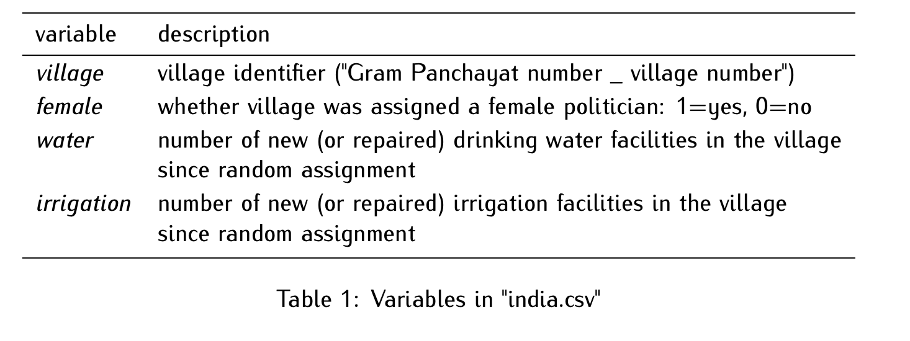

### Instructions

#### How to **complete** this assignment.

-   Attempt each exercise in order.

-   In each code chunk, if you see "<font color="789922">\# INSERT CODE HERE"</font>, then you are expected to add some code to create the intended output (Make sure to erase "\# INSERT CODE HERE" and place your code in its place).

-   If my instructions say to "Run the code below..." then you do not need to add any code to the chunk.

-   Many exercises may require you to type some text below the code chunk, interpreting the output and answering the questions.

-   Please follow the rules from the course syllabus regarding seeking help with this assignment.

#### How to **submit** this assignment.

-   When you are finished, click the "Render" button at the top of this panel. If there are no errors, an HTML file should pop up after a few seconds.

-   Take a look at the resulting HTML file that pops up. Make sure everything looks correct, your name is listed at the top, and that there is no 'junk' code or output.

-   Save the HTML file (to your local computer, and/or to a cloud location) as: **Problem Set 1 "Insert Your Name"**.

-   Before you upload the file to HuskyCT, you will need to zip/compress the file.

-   Upload the problem set zipped/compressed HTML to HuskyCT. **Do not** upload the original .qmd version.

-   This assignment is <font color="darkred">**due Monday, February 10, 2025, no later than 4:00 pm Eastern**</font>. Points will be deducted for late submissions.

-   <font color="darkblue">TIP:</font> Start early so that you can troubleshoot any issues with knitting to HTML.

#### Grading Rubric

There are 8 possible points on this assignment.

**Baseline (C level work)**

-   Your .qmd file knits to HTML without errors.
-   You answer questions correctly but do not use complete sentences.
-   There are typos and 'junk code' throughout the document.
-   You do not put much thought or effort into the Reflection answers.

**Average (B level work)**

-   You use complete sentences to answer questions.
-   You attempt every exercise/question.

**Advanced (A level work)**

-   Your code is simple and concise.
-   Unnecessary messages from R are hidden from being displayed in the HTML.
-   Your document is typo-free.
-   At the discretion of the instructor, you give exceptionally thoughtful or insightful responses.

------------------------------------------------------------------------

**Do Women Promote Different Policies than Men?**

(Based on Raghabendra Chattopadhyay and Esther Duflo. 2004. “Women as Policy Makers: Evidence from a Randomized Policy Experiment in India." Econometrica, 72 (5): 1409–43.)

We will analyze data from an experiment conducted in India, where villages were randomly assigned to have a female council head. The dataset we will use is in a file called “india.csv”. Table 1 shows the names and descriptions of the variables in this dataset, where the unit of observation is villages.

<center></center>

#### **Exercise 1. Using the correct R code, set your working directory. (1 point)**

```{r}

setwd("~/Dropbox/Schools/UCONN/Courses/Spring 2025/POLS 5605/Problem Sets/Problem Set 1")

```

#### **Exercise 2. Load the `tidyverse()` package. (1 point)**

```{r}

library(tidyverse)

```

#### **Exercise 3. Load the data and assign the name "india" to it. (1 point)**

```{r}

india <- read.csv("india.csv")

```

<br>

#### **Exercise 4. Utilizing either `head()` or `glimpse()` view the first few rows of the dataset. Substantively describe what these functions do. (1 point)**

```{r}
head(india)

glimpse(india)
```

<font color="darkred">**ANSWER:**</font>

<br>

#### **Exercise 5. What does each observation in this dataset represent?. (1 point)**

<font color="darkred">**ANSWER:**</font>

<br>

#### **Exercise 6. Please substantively interpret the first observation in the dataset. (1 point)**

<font color="darkred">**ANSWER:**</font>

<br>

#### **Exercise 7. For each variable in the dataset, please identify the type of variable (character vs. numeric binary vs. numeric non-binary) (1 point)**

<font color="darkred">**ANSWER:**</font>

<br>

#### **Exercise 8. How many observations are in the dataset? In other words, how many villages were part of this experiment? (Hint: the function `dim()` might be helpful here.) Additionally, provide a substantive answer. (1 point)**

```{r}
dim(india)
```

<font color="darkred">**ANSWER:**</font>
