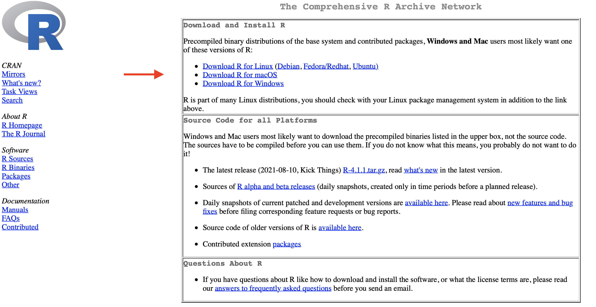
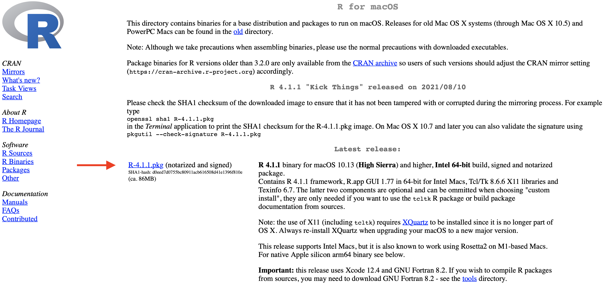
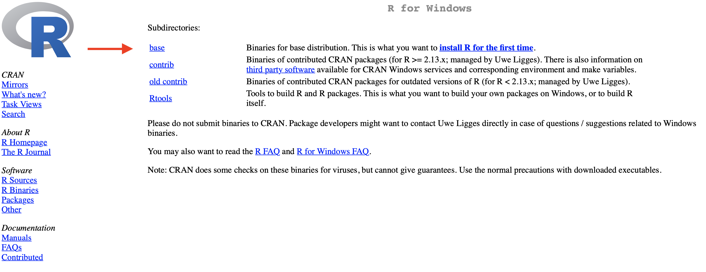
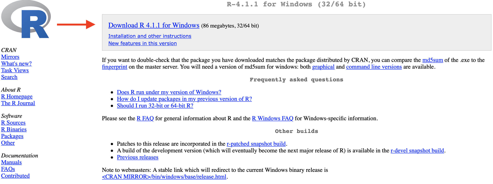
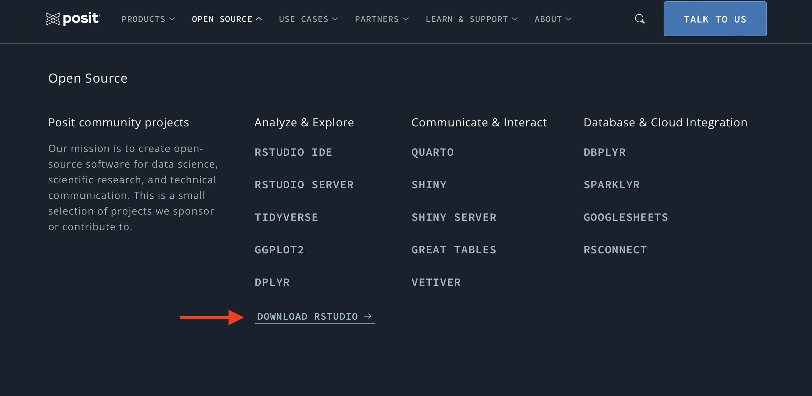
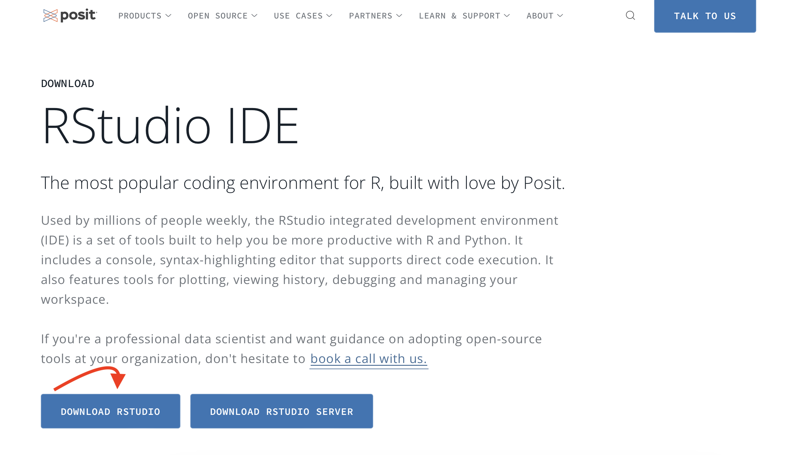
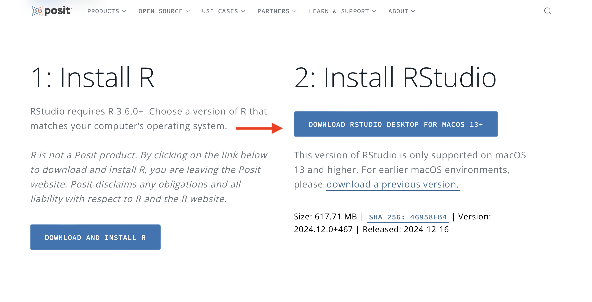

------------------------------------------------------------------------

### Overview

In today's class, we are going to use this tutorial to install R and RStudio on to our computers. Remember, the order in which you install these tools matters. You will need to install R, first, followed by R Studio. Please make sure that you follow these instructions. By the end of today's class, you will have completed the following:

-   Installed R

-   Installed RStudio

-   Opened RStudio

### Download and Install R

Please visit <https://cran.r-project.org>. Click on the download link corresponding to your operating system (e.g., Mac or Windows).

 

{fig-align="center" width="500in"}

### Mac OS Users

On the following page, click on the link that best describes your computers OS. Follow in the instructions.

 

{fig-align="center" width="500in"}

 

### Windows Users

On the next page, click on the first link to install **base R** for the first time.

 

{fig-align="center" width="500in"}

 

Finally, you will click the link at the top to download the latest version of R. Click this link to download the R installer.

 

{fig-align="center" width="500in"}

 

Once the download is complete, open the executable (\*.exe) file to begin installation of R. During the installation, you do not need to make any customization; keep the default settings recommended by the installer.

After you have finished installing R, you do not need to open it. You may proceed to the next part, downloading RStudio.

 

 

------------------------------------------------------------------------

### Download and Install RStudio

Go to <https://www.rstudio.com>, in order to download RStudio. Click on **OPEN SOURCE**

 

{fig-align="center" width="500in"}

 

Click on the first link under **DOWNLOAD RSTUDIO**

 

{fig-align="center" width="500in"}

 

Click on the link **DOWNLOAD RSTUDIO DESKTOP**

 

{fig-align="center" width="500in"}

 

Click on the link **DOWNLOAD RSTUDIO DESKTOP**

 

{fig-align="center" width="500in"}
