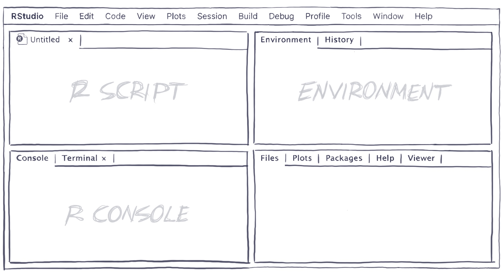
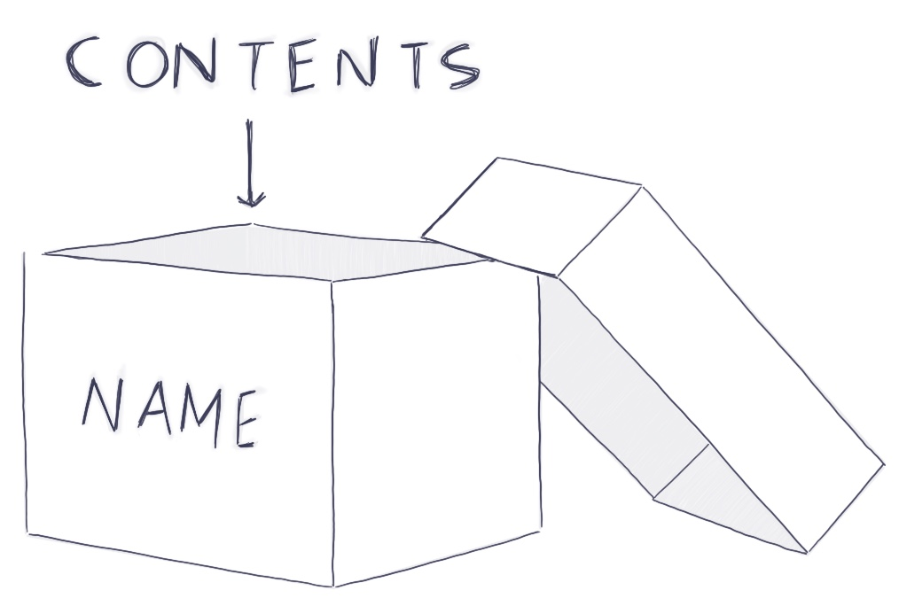
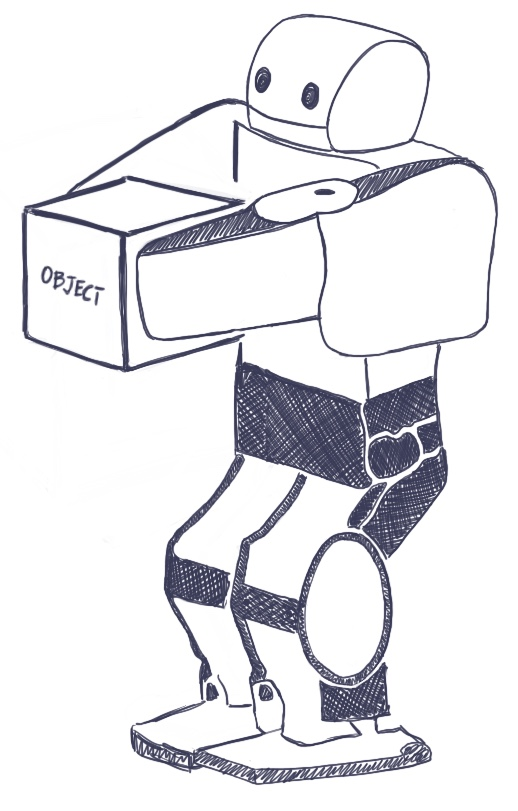
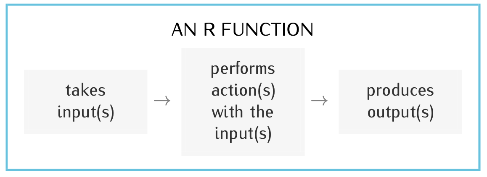
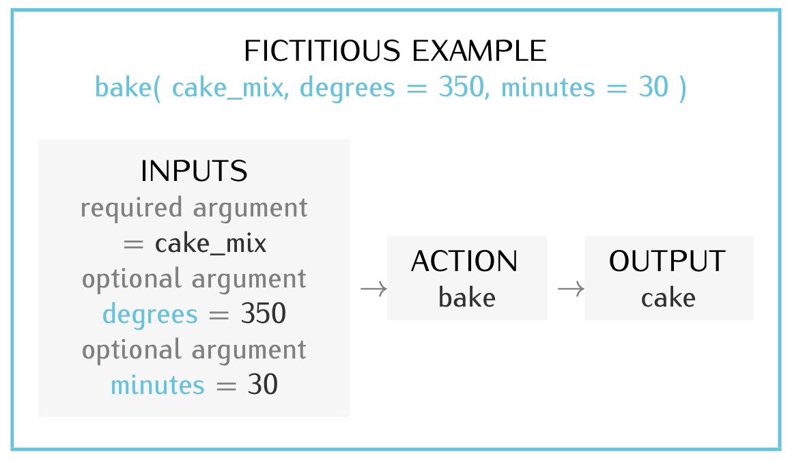

## If You are Worried Because...

-   You have never done any coding...
    -   Don't worry, I assume you haven't
    -   As long as you put in the time to do the work every week, you will do great!


## Plan for Today

-   Become familiar with R and RStudio

\vspace{.1cm}

-   Become familiar with R
    -   Do calculations: [+]{style="color:#000E2F"}, [-]{style="color:#000E2F"}, [$*$]{style="color:#000E2F"}, [/]{style="color:#000E2F"}
    -   Create objects: [$<-$]{style="color:#000E2F"}, ["]{style="color:#000E2F"}
    -   Use functions: [()]{style="color:#000E2F"}, [sqrt()]{style="color:#000E2F"}, [\#]{style="color:#000E2F"}


## R and RStudio

-   Recall, before class today you should have installed two programs in your computer:
    -   R () and RStudio ()

\vspace{.2cm}

-   [R]{style="color:#000E2F"} is the statistical program that will perform calculations and create graphics for us (it's the engine)

-   [RStudio]{style="color:#000E2F"} is the user-friendly interface that we will use to communicate with R

\vspace{.2cm}

-   We will never open R directly; we will always start by opening RStudio
    -   RStudio will open R by itself

## RStudio

-   Go ahead and open RStudio ()

\vspace{.2cm}

-   Then, open a new R script:
    -   drop down menu: File \> New File \> R Script

\vspace{.2cm}

-   What is a [R script]{style="color:#000E2F"}?
    -   type of file we use to store the code we write to analyze data

## RStudio Layout

<center></center>

## RStudio Layout

-   [R Script]{style="color:#000E2F"} (upper left window):
    -   Where we write and execute code

\vspace{.2cm}

-   [R Console]{style="color:#000E2F"} (lower left window):
    -   where R provides the executed code and its outputs (including errors)

\vspace{.2cm}

-   [Environment]{style="color:#000E2F"} (upper right window):
    -   Storage room of current R session
    -   Lists objects that we have created

\vspace{.2cm}

-   [Help]{style="color:#000E2F"} and [Plots]{style="color:#000E2F"} tabs (lower right window)

## The R Programming Language

-   To use R, we need to learn its language
    -   the R programming language
    -   R is both the name of the program and the name of the language

\vspace{.2cm}

-   Learning a programming language is like learning a foreign language
    -   not easy
    -   requires practice
    -   requires patience

## We will use R to:

::: extrapad
-   Do calculations
:::

-   Create objects

::: extrapad
-   Use functions
:::

## Calculations

-   We can use R as a fancy calculator
    -   R understands arithmetic operators such as [+]{style="color:#000E2F"}, [-]{style="color:#000E2F"}, [$*$]{style="color:#000E2F"}, [/]{style="color:#000E2F"}

\vspace{.2cm}

-   Let's ask R to calculate 20 plus 5

\vspace{.2cm}

-   First we type on the R script (upper left window): [20 + 5]{style="color:#000E2F"}

\vspace{.2cm}

-   Then, to execute this code: we highlight it and either
    1.  Manually hit the run icon ()
    2.  Use the shortcut *command + enter* in **Mac** or *ctrl + enter* in **Windows**

\vspace{.2cm}

-   Go ahead and do it

------------------------------------------------------------------------

-   In the console, you should see the following:

```{r}
#| echo: true

20 + 5
```

<br>

-   First, the executed code [20 + 5]{style="color:#000E2F"}
    -   Then, the output of the executed code [\## \[1\] 25]{style="color:#000E2F"}

\vspace{.2cm}

-   What does the \[1\] mean?
    -   It indicates that the output immediately to its right is the first (and only, in this case) output

\vspace{.2cm}

-   The title of the R script is now highlighted in a different color to indicate that you have unsaved changes
    -   To save the R script either use shortcuts (command + S or ctr + S) or click on File \> Save (or Save As...)
    -   Name it "lecture2" so that you know what it refers to

------------------------------------------------------------------------

-   In our textbooks, as well as in our lectures, you will probably see the output that you should see in the console right after the code that produces it, like so:
    -   [20 + 5]{style="color:#000E2F"}
    -   [\## \[1\] 25]{style="color:#000E2F"}

\vspace{.2cm}

-   [20 + 5]{style="color:#000E2F"} is the code to be typed and executed on the R script (the code that R will execute)

\vspace{.2cm}

-   The symbol [\##]{style="color:#000E2F"} indicates the beginning of the output

\vspace{.2cm}

-   [\[1\] 25]{style="color:#000E2F"} is the output (what you should see in the console after the executed code)

## Create Objects

-   R Stores information in the form of [objects]{style="color:#000E2F"}

\vspace{.2cm}

-   In order to analyze data, we will need to create objects

\vspace{.2cm}

-   An object is like a box that can contain anything
    -   To create an object, we need to:
        -   Give it name
        -   Specify its contents
        -   Use the assignment operator [$<-$]{style="color:#000E2F"}

\vspace{.2cm}

<center></center>

------------------------------------------------------------------------

In R, we use the assignment operator [$<-$]{style="color:#000E2F"} to create an object:

\vspace{.2cm}

-   To its left, we specify the name of the object
    -   A name cannot begin with a number, contain spaces, or special symbols (i.e., \$ or %) that are reserved for other purposes
    -   A name can contain <span style="color:#000E2F">\_</span> underscores, which are good substitutes for spaces

\vspace{.2cm}

-   To its right, we specify the content of the object

<br>

<center>object_name [$<-$]{style="color:#000E2F"} object_content</center>

------------------------------------------------------------------------

<center>object_name [$<-$]{style="color:#000E2F"} object_content</center>

<br>

-   For example, type and run:

<center>object_name [twentyfive $<-$ 25]{style="color:#000E2F"} object_content</center>

<br>

-   After executing this code, the object *twentyfive* will show up in the Environment (the upper right window of RStudio)

\vspace{.2cm}

-   To find out the contents of an object, you can run the name of the object in R:

```{r}
#| echo: true

twentyfive <- 25

twentyfive
```

------------------------------------------------------------------------

-   Objects can contain text as well as numbers

\vspace{.2cm}

-   Execute: [class $<-$ "pols5605"]{style="color:#000E2F"}

\vspace{.2cm}

-   Now in the environment there should be two objects
    -   What are they?

\vspace{.2cm}

-   Note that in this last piece of code we used ["]{style="color:#000E2F"} around the contents, but we did not use ["]{style="color:#000E2F"} in the previous piece of code

\vspace{.2cm}

<center>[twentyfive $<-$ 25]{style="color:#000E2F"} vs [class $<-$ "pols5605"]{style="color:#000E2F"}</center>

<br>

-   Why?

------------------------------------------------------------------------

When do we need to use ["]{style="color:#000E2F"} when writing code in R?

\vspace{.2cm}

-   the names of objects, names of functions, and names of arguments as well as special values such as TRUE, FALSE, NA, and NULL should NOT be in quotes

\vspace{.2cm}

-   All other text should be in quotes

-   Numbers should never be in quotes unless you want R to treat them as text

------------------------------------------------------------------------

-   What would happen if you executed: [class $<-$ pols5605]{style="color:#000E2F"}

    </center>

    -   You will receive an error: [Error: object 'pols5605 not found]{style="color:#000E2F"}

        </center>

        -   without the ["]{style="color:#000E2F"}, R thinks that *pols5605* is the name of an object and R is right; there is no object called *pols5605* in the environment

\vspace{.2cm}

-   Running into errors is part of the coding process
    -   Do not be discouraged
    -   If you have problems figuring out what a particular error means, Google it; there are lots of Q&A sites
        -   Copy and paste the error directly into Google

------------------------------------------------------------------------

-   R will overwrite objects if you assign new content to an existing object name

```{r}
#| echo: true

class <- "pols5605"

class
```

<br>

```{r}
#| echo: true

class <- "data analysis"

class
```

-   Notice that class now contains the text "data analysis" instead of "pols5605"

------------------------------------------------------------------------

-   R is case sensitive
    -   *class* is different than *Class*
    -   To avoid confusion, try to utilize lower-case letters when naming objects

## Use Functions

-   Think of a function as an action that you request R to perform on a particular object or piece of data, such as calculating the square root of 25

<center></center>

------------------------------------------------------------------------

<center></center>

<br>

-   A [function]{style="color:#000E2F"}:
    -   takes input(s)
        -   example: takes the number 25
    -   Performs an action with the input(s)
        -   computes $\sqrt{25}$
    -   Produces an output
        -   Produces the number 5

------------------------------------------------------------------------

-   We will learn how to use these functions and others throughout this semester:
    -   [sqrt()]{style="color:#000E2F"}, [setwd()]{style="color:#000E2F"}, [read.csv]{style="color:#000E2F"}, [View()]{style="color:#000E2F"}, [head()]{style="color:#000E2F"}, [dim()]{style="color:#000E2F"}, [mean()]{style="color:#000E2F"}, [ifelse()]{style="color:#000E2F"}, [table()]{style="color:#000E2F"}, [prop.table()]{style="color:#000E2F"}, [ggplot()]{style="color:#000E2F"}, [median()]{style="color:#000E2F"}, [lm()]{style="color:#000E2F"}, [print()]{style="color:#000E2F"}, and [summary()]{style="color:#000E2F"}

\vspace{.2cm}

-   In time, we will learn:
    -   Their names
    -   The actions they perform
    -   The inputs they require
    -   The outputs they produce

------------------------------------------------------------------------

-   The name of a function (without quotes) is always followed by parentheses: [function_name()]{style="color:#000E2F"}

\vspace{.2cm}

-   Inside the parentheses, we specify the inputs, which we refer to as arguments: [function_name(arguments)]{style="color:#000E2F"}

\vspace{.2cm}

-   Most functions require that we specify at least one argument but can take many optional arguments
    -   some arguments are required, others are optional

\vspace{.2cm}

-   When multiple arguments are specified inside the parentheses, they are separated by commas: [function_name(argument1, argument2)]{style="color:#000E2F"}

------------------------------------------------------------------------

-   To specify the arguments, we enter them in a particular order or include the name of the argument (without quotes) in our specification:
    -   [function_name(argument1, argument2)]{style="color:#000E2F"}
    -   [function_name(argument1_name = argument1, argument2_name = argument2)]{style="color:#000E2F"}

\vspace{.2cm}

-   We always specify required arguments first

\vspace{.2cm}

-   If there is more than one required argument, we enter them in the order expected by R

\vspace{.2cm}

-   We specify any optional arguments we want next and include their names:
    -   [function_name(required_arguments, optional_argument_name = optional_argument)]{style="color:#000E2F"}

## Function Example

-   Suppose R were capable of baking and that it had a function named bake() that, by default, bakes the specified ingredient for 60 minutes at 400F

\vspace{.2cm}

-   Required argument = the ingredient
    -   Our ingredient is [cake mix]{style="color:#000E2F"}

\vspace{.2cm}

-   Optional arguments: named [degrees]{style="color:#000E2F"} and [minutes]{style="color:#000E2F"} to change the default temperature and duration of the bake, respectively
    -   [degrees = 350]{style="color:#000E2F"} which changes the temperature to 350F
    -   [minutes = 30]{style="color:#000E2F"} which changes the duration of bake to 30 minutes

------------------------------------------------------------------------

-   The following code would ask R to bake a cake mix for 30 minutes at 350F, so that we can have cake as the output:

<center></center>

## Function Example Part Deux

-   [sqrt()]{style="color:#000E2F"} computes the square root of the argument specified inside the parentheses. To compute [$\sqrt{25}$]{style="color:#000E2F"}, run:

```{r}
#| echo: true

sqrt(25)
```

-   [sqrt]{style="color:#000E2F"} is the name of the function, which, as all function names, is followed by parentheses [()]{style="color:#000E2F"}

-   [25]{style="color:#000E2F"} is the required argument

-   [5]{style="color:#000E2F"} is the output

------------------------------------------------------------------------

-   Alternatively, since the object *twentyfive* contains the number 25, we can run:

```{r}
#| echo: true

sqrt(twentyfive)
```

<br>

-   R will give you an error message if you run this line of code before creating the object *twentyfive*

-   Code is sequential! One must run code in order

    -   Whenever returning to work on an R script, run all the code from the beginning

## Good Coding Practices

-   It is good practice to comment code
    -   Include short notes to yourself or your collaborators explaining what the code does

\vspace{.2cm}

-   To comment code, we use [\#]{style="color:#000E2F"}
    -   R ignores everything that follows this character until the end of the line

```{r}
#| echo: true

#calculate the square root
sqrt(25)


sqrt(25) #calculates square root of 25
```

------------------------------------------------------------------------

-   Before closing your computer, remember to save the R script, otherwise you risk losing unsaved changes
    -   Either use shortcuts (command + S or ctr + S)
    -   Click on File \> Save
-   If you quit RStudio, R will ask whether you want to save the work space image, which contains all the objects you have created during the R session
    -   I recommend that you do not save it
    -   You can always re-create the objects by re-running the code in your R script

## For Next Class

-   Review what you learned today

-   Do new set of readings:

-   [HOPR Appendix D]{style="color:#000E2F"}

    -   [R4DS Chapter 4]{style="color:#000E2F"}
    -   [R4DS Chapter 6]{style="color:#000E2F"}
    -   [R4DS Chapter 7]{style="color:#000E2F"}
    -   [R4DS Chapter 8]{style="color:#000E2F"}
        -   Follow along the exercises with your own computer

-   Bring your laptops to class

