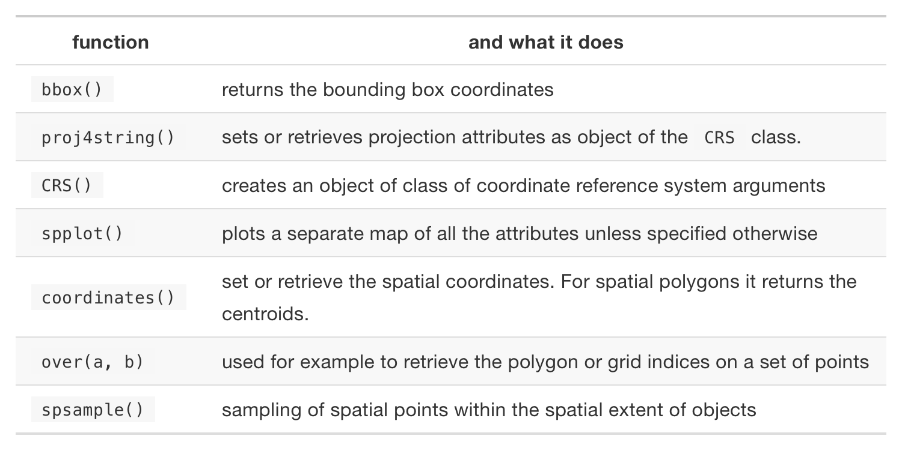

```{r}
#| include: FALSE
library(tidyverse)
knitr::opts_chunk$set(eval = TRUE, echo = TRUE)
```

## Plan for Today

- Exploring geolocated data in R
- Examining the `sp` and `sf` packages
- Discuss geographic data


## What is Geographic Data?

- Geographic data corresponds to data that have been linked to a geographic coordinate system

  + Think latitude and longitude
  
- Working with geographically located data is a relatively new phenomenon

  + It requires a significant amount of computing power and specialized programs
  
- Nowadays such lack of geographic data is hard to imagine

  + Every smartphone has a global positioning (GPS) receiver and a multitude of sensors on devices ranging from satellites and semi-autonomous vehicles to citizen scientists incessantly measure every part of the world
  
## What is Geographic Data?
  
```{r}
#install.packages("leaflet")
library(leaflet)

popup = c("Storrs, Connecticut")
leaflet() %>% 
  setView(lng = -72.251194, lat = 41.807417, zoom = 1)%>%
  addProviderTiles("NASAGIBS.ViirsEarthAtNight2012") %>%
    addMarkers(lng = c(-72.251194),
             lat = c(41.807417), 
             popup = popup)
```

## What is Geographic Data?

```{r}
popup = c("SSH Building")
leaflet() %>% 
  setView(lng = -72.251194, lat = 41.807417, zoom = 12)%>%
  addTiles() %>%
  addMarkers(lng = c(-72.251194),
             lat = c(41.807417), 
             popup = popup)
```


## How Does R Handle Geography?

- There are many ways to handle geographic data in R, with dozens of packages in the area

- The ones that we will focus on in this course are:

  + `sp`
  
  + `sf` (very functional with the `tidyverse`)
  
  + `raster`
  
- Honorable mentions

  + `maptools`
  
  + `rgdal`
  


## The `sp` Package

- The first general package to provide classes and methods for spatial data types that was developed for R is called `sp`

- The package provides classes and methods to create points, lines, polygons, and grids and to operate on them

- Let's build a `sp` object:

```{r}
#install.packages("sp")
library(sp)

#create the highways 
ln1 <- Line(matrix(runif(6), ncol=2))
ln1

ln2 <- Line(matrix(runif(6), ncol=2))
ln2

str(ln1)
```

- Note that the `@coords` slot holds the coordinates 


## The `sp` Package

```{r}
#combine the highways to a Lines object
lns1 <- Lines(list(ln1), ID = c("hwy1")) 
lns2 <- Lines(list(ln2), ID = c("hwy2")) 

str(lns1)
```

- The `Line` objects are now in a list and we have an additional ID slot, which uniquely identifies each `Line` object 

```{r}
#create a geospatial object with SpatialLines
sp_lns <- SpatialLines(list(lns1, lns2))

str(sp_lns)
```

## The `sp` Package

```{r}
#create a SpatialLinesDataframe
dfr <- data.frame(id = c("hwy1", "hwy2"), # note how we use the same IDs from above!
                  cars_per_hour = c(78, 22)) 

sp_lns_dfr <- SpatialLinesDataFrame(sp_lns, dfr, match.ID = "id")

str(sp_lns_dfr)

spplot(sp_lns_dfr, "cars_per_hour")
```

- Useful things to know in `sp`

<center></center>


## The `sf` Package

- `sf` implements a formal standard called “Simple Features” that specifies a storage and access model of spatial geometries (point, line, polygon)

- A feature geometry is called simple when it consists of points connected by straight line pieces, and does not intersect itself

  + This standard has been adopted widely
  
- Data are structured and conceptualized very differently from the `sp` approach

## `sf` Package

- Let's recreate the `sp` object from above in `sf`

```{r}
#install.packages("sf")
library(sf)

#create the highways 
lnstr_sfg1 <- st_linestring(matrix(runif(6), ncol=2)) 
lnstr_sfg1

lnstr_sfg2 <- st_linestring(matrix(runif(6), ncol=2)) 
lnstr_sfg2

class(lnstr_sfg1)
```

- We would then combine this into a simple feature collection

```{r}
#combine the highways into a simple feature
lnstr_sfc <- st_sfc(lnstr_sfg1, lnstr_sfg2) # just one feature here
lnstr_sfc
```

```{r}
#create our spatial data frame
lnstr_sf <- st_sf(dfr , lnstr_sfc)
lnstr_sf

plot(lnstr_sf["cars_per_hour"])

ggplot(lnstr_sf) + 
  geom_sf(aes(color = cars_per_hour))
```

- Useful methods in `sf`

```{r}
methods(class = "sf")
```


## Raster Data

- Raster files, as you might know, have a much more compact data structure than vectors

- A raster is defined by: 

  + a CRS
  
  + coordinates of its origin
  
  + a distance or cell size in each direction
  
  + a dimension or numbers of cells in each direction
  
  + an array of cell values
  
## Raster Data
  
```{r}
#install.packages("raster")
library(raster)

HARV <- raster("HARV_RGB_Ortho.tif")

HARV

plot(HARV)
```

- This raster is generated as part of the NEON Harvard Forest field [site](https://www.neonscience.org/field-sites/harv)  

```{r}
#useful commands

crs(HARV)

methods(class = class(HARV))

```


## Break