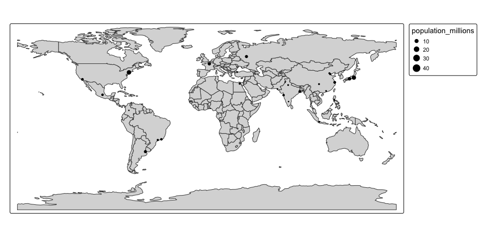

```{r}
#| include: FALSE
library(tidyverse)
knitr::opts_chunk$set(eval = TRUE, echo = TRUE)
```

## Plan for Today

-   Explore plotting geolocated data in R

## `tmap`

-   Recall, `tmap` is based on the idea of a 'grammar of graphics' similar to `ggplot`

    -   This involves a separation between the input data and the aesthetics (how data are visualized): each input dataset can be ‘mapped’ in a range of different ways including location on the map (defined by data’s geometry), color, and other visual variables

-   `tm_shape()`

    -   defines the data, raster, and vector objects

-   `tm_fill()` & `tm_borders()`

    -   Control the layers that are added to represent `nz` visually

## `tmap`

```{r}
#| eval: TRUE
#| echo: TRUE
#| out-width: 100%
#| out-height: 100%
#
#install.packages("spData")
library(spData)
library(tmap)

# Add fill layer to nz shape
tm_shape(nz) +
  tm_fill() 

# Add border layer to nz shape
tm_shape(nz) +
  tm_borders() 

# Add fill and border layers to nz shape
tm_shape(nz) +
  tm_fill() +
  tm_borders() 
```

## `tmap`

-   A useful feature of `tmap` is its ability to store objects representing maps

```{r}
#| eval: TRUE
#| echo: TRUE
#| out-width: 100%
#| out-height: 100%

map_nz = tm_shape(nz) + tm_polygons()

class(map_nz)
```

-   This allows you to plot your maps later and/or add additional layers

```{r}
#| eval: FALSE

map_nz1 = map_nz +
  tm_shape(elev) + tm_raster(alpha = 0.7)

map_nz1
```

## `tmap`

-   There are no limits to the number of layers or shapes that can be added to `tmap` objects

-   Additionally, `tmap` allows multiple map objects to be arranged in a single plot with `tmap_arrange()`

```{r}
#| eval: FALSE

#map 2
nz_water = st_union(nz) |> st_buffer(22200) |> 
  st_cast(to = "LINESTRING")
map_nz2 = map_nz1 +
  tm_shape(nz_water) + tm_lines()

#map 3
map_nz3 = map_nz2 +
  tm_shape(nz_height) + tm_dots()

#combined
tmap_arrange(map_nz1, map_nz2, map_nz3)
```

## Aesthetics

-   There are two main types of map aesthetics: those that change with the data and those that are constant

```{r}
#| eval: TRUE
#| echo: TRUE
#| out-width: 100%
#| out-height: 100%

ma1 = tm_shape(nz) + tm_fill(col = "red")

ma2 = tm_shape(nz) + tm_fill(col = "red", alpha = 0.3)

ma3 = tm_shape(nz) + tm_borders(col = "blue")

ma4 = tm_shape(nz) + tm_borders(lwd = 3)

ma5 = tm_shape(nz) + tm_borders(lty = 2)

ma6 = tm_shape(nz) + tm_fill(col = "red", alpha = 0.3) +
  tm_borders(col = "blue", lwd = 3, lty = 2)

tmap_arrange(ma1, ma2, ma3, ma4, ma5, ma6)
```

## Color Settings

-   Color settings are an important part of map design. They can have a major impact on how spatial variability is portrayed

```{r}
#| eval: TRUE
#| echo: TRUE
#| out-width: 100%
#| out-height: 100%

tm_shape(nz) + tm_polygons(col = "Median_income")
breaks = c(0, 3, 4, 5) * 10000

tm_shape(nz) + tm_polygons(col = "Median_income", breaks = breaks)

tm_shape(nz) + tm_polygons(col = "Median_income", n = 10)

tm_shape(nz) + tm_polygons(col = "Median_income", palette = "BuGn")
```

## Faceted Maps

-   Faceted maps, also referred to as ‘small multiples,’ are composed of many maps arranged side-by-side

```{r}
#| eval: TRUE
#| echo: TRUE
#| out-width: 100%
#| out-height: 100%

urb_1970_2030 <- urban_agglomerations |>
  filter(year == 1970| year == 1990 | year == 2010 | year == 2030) 


tm_shape(world) +
  tm_polygons() +
  tm_shape(urb_1970_2030) +
  tm_symbols(col = "black", border.col = "white", size = "population_millions") +
  tm_facets(by = "year", nrow = 2, free.coords = FALSE)
```

## Animated Maps

```{r}
#| eval: TRUE
#| echo: TRUE
#| out-width: 100%
#| out-height: 100%

urb_anim = tm_shape(world) + tm_polygons() + 
  tm_shape(urban_agglomerations) + tm_dots(size = "population_millions") +
  tm_facets(along = "year", free.coords = FALSE)
```

## Animated Maps

-   The resulting `urb_anim` represents a set of separate maps for each year

-   The final stage is to combine them and save the result as a `.gif` file with `tmap_animation()`

```{r}
#| eval: TRUE
#| echo: TRUE
#| out-width: 100%
#| out-height: 100%

#install.packages("gifski")
library(gifski)

tmap_animation(urb_anim, filename = "urb_anim.gif", delay = 25)
```

<center></center>

## Interactive Maps

-   Interactivity can take many forms, the most common and useful of which is the ability to pan around and zoom into any part of a geographic dataset overlaid on a ‘web map’ to show context

-   A unique feature of `tmap` is its ability to create static and interactive maps using the same code

```{r}
#| eval: TRUE
#| echo: TRUE
#| out-width: 100%
#| out-height: 100%

tmap_mode("view")
map_nz
```

-   Now that the interactive mode has been ‘turned on,’ all maps produced with `tmap` will launch (another way to create interactive maps is with the `tmap_leaflet function`)

```{r}
#| eval: TRUE
#| echo: TRUE
#| out-width: 100%
#| out-height: 100%

map_nz + tm_basemap(server = "OpenTopoMap")
```

## Interactive Maps

-   An impressive and little-known feature of tmap’s view mode is that it also works with faceted plots

```{r}
#| eval: TRUE
#| echo: TRUE
#| out-width: 100%
#| out-height: 100%

world_coffee = left_join(world, coffee_data, by = "name_long")
facets = c("coffee_production_2016", "coffee_production_2017")
tm_shape(world_coffee) + tm_polygons(facets) + 
  tm_facets(nrow = 1, sync = TRUE)
```

## Merging with Geometry and Data

-   Every now and again you might need to merge a shape file (geometry) with a data frame

-   You complete this in a very similar manner as joining two regular data frames

-   We are going to use Census data from Mecklenberg County

```{r}
#| eval: FALSE

library(tidycensus)

meck_black <- get_decennial(geography = "tract", 
                            variables = "P005004",
                            summary_var = "P001001", 
                            state = "NC", 
                            county = "Mecklenburg",
                            year=2010, 
                            geometry = TRUE) 

meck_white <- get_decennial(geography = "tract", 
                            variables = "P005003",
                            summary_var = "P001001", 
                            state = "NC", 
                            county = "Mecklenburg",
                            year=2010, 
                            geometry = FALSE)

```

## Merging with Geometry and Data

-   We want to join the population of African American citizens with white citizens, by Census tract, in Mecklenburg county

-   Let's join them below

```{r}
#| eval: FALSE

meck_bw <- meck_black |>
  left_join(meck_white, 
            by=c("GEOID", "NAME", "summary_value"),
            suffix = c("_black", "_white")) |>
  mutate(pct_white = value_white / summary_value,
         pct_black = value_black / summary_value)

```

-   Let's plot it

```{r}
#| eval: FALSE

meck_one <- meck_bw |>
  tm_shape() +
  tm_polygons("pct_white")

meck_one

meck_two <- meck_bw |>
  tm_shape() +
  tm_polygons("pct_black")

meck_two

tmap_arrange(meck_one, meck_two)
```

## Plotting with `sf`

-   Using shapefiles from the US Census

    -   Shapefiles provide the geographic coordinates for a specific boundary

    -   It's essentially a set of related files that contain the spatial data (geometry), an index to that data, and attribute information about each feature.

```{r}
library(sf)

congdistricts <- st_read("districts116.shp") |>
  arrange(STATENAME, DISTRICT)
```

-   We will filter the data to only include Connecticut and then plot the congressional districts

```{r}
ct <- congdistricts |>
  filter(STATENAME == "Connecticut")
```

## Plotting with `sf`

-   We can use the `plot()` function

```{r}
plot(ct)
#
plot(ct$geometry)
```

## Plotting with `sf`

-   We can also use `ggplot()`

```{r}
ggplot() +
  geom_sf(data = ct)
```

-   As is expected, the basic `ggplot()` call is not visually appealing

```{r}
ggplot() +
  geom_sf(data = ct$geometry, fill = "white") +
  theme_bw() +
  theme(panel.border = element_blank(),
        panel.grid.major = element_blank(), 
        panel.grid.minor = element_blank(),
        axis.text.x = element_blank(), 
        axis.ticks.x = element_blank(), 
        axis.text.y = element_blank(),  
        axis.ticks.y = element_blank(),
        plot.caption = element_text(hjust = 0.5))
```

## Raster Data

-   Raster files, as you might know, have a much more compact data structure than vectors

-   A raster is defined by:

    -   a CRS

    -   coordinates of its origin

    -   a distance or cell size in each direction

    -   a dimension or numbers of cells in each direction

    -   an array of cell values

## Raster Data

-   Let's look at a population raster

```{r}
library(raster)

popraster <- raster("gpw_v4_population_count_rev11_2020_30_sec.tif")
```

-   This raster presents population estimates for the entire world in 2020

-   While we could try and plot this...

    -   It would take a lot of computing power and not really reveal anything to us

    -   Let's extract the raster data for the area that we care about (i.e., the congressional districts of Connecticut)

## Raster Data

-   Let's create a raster file that is concentrated on Connecticut

```{r}
#create boundary for raster data for CT 2nd district
CTrasterdata <- mask(crop(popraster, extent(ct)), ct)
```

-   Let's plot the raster data

```{r}
#| out-width: 100%
#| out-height: 100%

plot(CTrasterdata)
```

## Raster Data

-   Let's plot with `ggplot()`

```{r}
#| out-width: 100%
#| out-height: 100%

#convert raster data to spatial points
trythis <- rasterToPoints(CTrasterdata) %>%
  data.frame() %>%
  rename(pop = gpw_v4_population_count_rev11_2020_30_sec)

#raster data
ggplot() +
  geom_sf(data = ct$geometry, colour = NA) +
  geom_raster(data = trythis, mapping = aes(x = x, y = y, fill = pop), alpha = 0.5) +
  scale_fill_gradientn(colours = rev(terrain.colors(10))) +
  theme_bw() +
  theme(panel.border = element_blank(),
        panel.grid.major = element_blank(), 
        panel.grid.minor = element_blank(),
        axis.text.x = element_blank(),
        axis.title.x = element_blank(),
        axis.title.y = element_blank(),
        axis.ticks.x = element_blank(), 
        axis.text.y = element_blank(),  
        axis.ticks.y = element_blank(),
        legend.position="none",
        plot.caption = element_text(hjust = 0.5))

#raster data with CDs
ggplot() +
  geom_sf(data = ct$geometry, colour = "black") +
  geom_raster(data = trythis, mapping = aes(x = x, y = y, fill = pop), alpha = 0.5) +
  scale_fill_gradientn(colours = rev(terrain.colors(10))) +
  theme_bw() +
  theme(panel.border = element_blank(),
        panel.grid.major = element_blank(), 
        panel.grid.minor = element_blank(),
        axis.text.x = element_blank(),
        axis.title.x = element_blank(),
        axis.title.y = element_blank(),
        axis.ticks.x = element_blank(), 
        axis.text.y = element_blank(),  
        axis.ticks.y = element_blank(),
        legend.position="none",
        plot.caption = element_text(hjust = 0.5))
```

## Raster Data

-   How can we use raster data?

-   We can extract the estimates from the raster and use them

```{r}
library(exactextractr)

ct_pop_estimate <- round(exact_extract(CTrasterdata, ct, 'sum'), 3) %>%
          data.frame() %>%
          rename(popSUM = ".")


ct_pop_estimate
```

## Break
