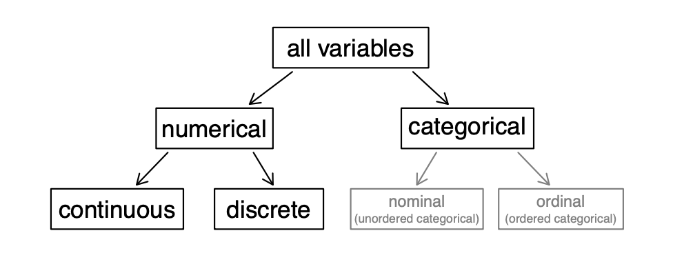

## Plan for Today

-   Quick Overview of Variable Types in R

-   Messy Data. Why?

-   Cleaning up messy data in R

-   In class activity

## Variable Types

<center></center>

## Variable Types: Numerical

::: extrapad
-   Continuous
    -   Regular numbers representing a large range of values
    -   Common examples: income, age, score
:::

::: extrapad
-   Discrete
    -   Still numeric, but representing a finite number of groups
    -   Common examples: age group, graduation year, number of siblings
:::

::: extrapad
-   Sometimes it's not really clear whether the variable should be treated as continuous or discrete
    -   Plot the data to investigate
:::

## Variable Types: Categorical

::: extrapad
-   Nominal
    -   No inherent order
    -   Common examples: gender, color, ethnicity
:::

::: extrapad
-   Ordinal
    -   Order matters
    -   Common examples: high -\> medium -\> low, UCONN Class (First year, second year, etc.)
:::

## Other Variable Types

::: extrapad
-   Logical
    -   True/False
:::

::: extrapad
-   Date
    -   R has many functions to handle different types of data variables
:::

## Why Do We Care

-   Determines how we
    -   Visualize Data
    -   Summarize Data (mean, median, frequency)
    -   Perform Statistical Tests
    -   Build Statistical Models

## What is Messy Data

::: extrapad
-   Examine both the data and the metadata (if it is included)
:::

::: extrapad
-   Many "NAs" and other missing data
:::

::: extrapad
-   Variable names require fixes
:::

::: extrapad
-   Inconsistent/incorrect formatting
    -   Dates
    -   Proper nouns
    -   Numbers appearing as characters
:::

-   Untidy data

## Extra Data

::: extrapad
-   Usually at the beginning or end of the dataset
:::

::: extrapad
-   Contains information that cannot be analyzed (not an observation or value)
:::

## Missing Data

There are two main types of missing data

-   Explicit
    -   Presence of absence (flagged with "NAs")
-   Implicit
    -   Absence of presence (not in the data at all)

```{r}
#| eval: TRUE
#| echo: TRUE

stocks <- data.frame(
  year  = c(2015, 2015, 2015, 2015, 2016, 2016, 2016),
  name  = c("AAPL", "AAPL", "AAPL", "AAPL", "AAPL", "AAPL", "AAPL"),
  qtr   = c(   1,    2,    3,    4,    2,    3,    4),
  return = c(1.88, 0.59, 0.35,   NA, 0.92, 0.17, 2.66)
)
```

------------------------------------------------------------------------

```{r}
#| eval: FALSE

View(stocks)
```

```{r}
#| echo: TRUE

stocks
```

## Variable Names

::: extrapad
-   Should not include spaces
    -   "variable 1"
:::

::: extrapad
-   Should not be too long
    -   "This variable corresponds to the gender of respondents"
:::

::: extrapad
-   Should not contain special characters
    -   "This variable is the % of respondents"
:::

::: extrapad
-   Cannot start with a number
    -   "1949-2006 years"
:::

::: extrapad
-   Should be concise, but descriptive
    -   "age"
    -   "gender"
    -   "race"
:::

## Inconsistent/Incorrect Formatting

-   Dates
-   Character variables with similar values
    -   Different cases
    -   Misspellings
    -   Extra spaces

## For Next Class

-   Review what you learned today

-   Do new set of readings:

    -   [ R4DS Chapter 1]{style="color:#000E2F"}
    -   [ R4DS Chapter 9]{style="color:#000E2F"}
    -   [ R4DS Chapter 11]{style="color:#000E2F"}
        -   Follow along the exercises with your own computer

-   Bring your laptops to class
