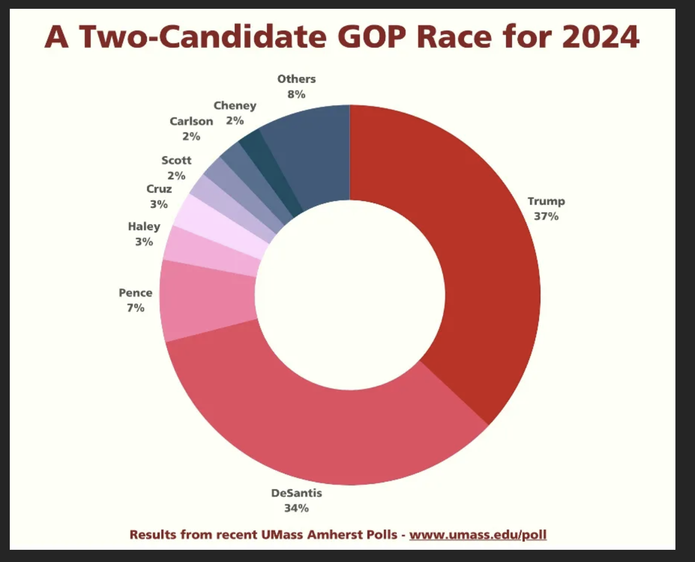

## Plan for Today

-   Why visualizing data is important

::: extrapad
-   Strategies for effective visualizations
:::

::: extrapad
-   In class activity
:::

## Importance of Visualizing Data

-   Exploration vs. explanation

::: extrapad
-   Get a glimpse at patterns and relationships within the data
:::

::: extrapad
-   When done well, creates value for stakeholders
:::

::: extrapad
-   When done poorly, spreads misinformation and leads to false conclusions and flawed knowledge
:::

## Ineffective Visualizations

-   Use of 3-D to model 1-D or 2-D relationships

::: extrapad
-   Meaningless use of color
:::

::: extrapad
-   Lack of informative labeling/titles
:::

::: extrapad
-   Overly fancy charts
:::

::: extrapad
-   Cluttered visualizations
:::

::: extrapad
-   Pie charts (just...don't)
:::

------------------------------------------------------------------------

<center></center>

------------------------------------------------------------------------

<center></center>

------------------------------------------------------------------------

<center></center>

## Strategies for Effective Visualization

-   Just because you can create a particular type of graph or visualization, doesn't always mean that you should

::: extrapad
-   Start with questions:
    -   What do they convey?
    -   What is the appropriate visual tool?
    -   How can I minimize the amount of ?
    -   How can i draw attention where I want it?
    -   Can I add information to make the story clear?
:::

## How to Evaluate a Visualization

-   Who is the intended audience?

::: extrapad
-   What story does it tell?
    -   What is the intent (explore or explain)?
:::

::: extrapad
-   Is the story compelling?
:::

::: extrapad
-   Was the right type of visual used?
:::

::: extrapad
-   What information is missing?
    -   Implicit vs Explicit
:::

## Effective Visualization

-   Understand the context

::: extrapad
-   Choose an appropriate visual display
:::

::: extrapad
-   Eliminate clutter
:::

::: extrapad
-   Focus attention where you want it
    -   Aesthetics
:::

::: extrapad
-   Think like a designer
:::

::: extrapad
-   Tell a story
:::

## Telling Your Story

-   Know your audience

::: extrapad
-   Make your graphics self-explanatory
    -   Labels, titles, etc.
:::

::: extrapad
-   What interpretations/conclusions are you leaving your audience to make?
    -   Are they correct?
:::

## ggplot

-   Load the `mpg` data

```{r}
#| eval: TRUE
#| echo: TRUE
library(tidyverse)

mpg
```

------------------------------------------------------------------------

-   What does the data look like?

```{r}
#| eval: FALSE
#| echo: TRUE

mpg <- mpg

glimpse(mpg)
View(mpg)
?mpg
```

------------------------------------------------------------------------

-   Create a plot that examines how the size of a cars engine impacts its fuel efficiency.

```{r}
#| eval: TRUE
#| echo: TRUE
#| out-width: 100%
#| out-height: 100%

ggplot(data = mpg) + 
  geom_point(mapping = aes(x = displ, y = hwy))
```

-   Recall

    -   `ggplot()` is the plot function
        -   Creates a coordinate system that you can add layers to
    -   `(Data =)` is where you specify the dataset that you are using
    -   `geom_point()` is an added layer, which specifies how the data will be plotted
    -   `mapping` defines how variables in your dataset are mapped to visual properties
    -   `aes` specify which variables to map to the x and y axes

------------------------------------------------------------------------

-   For example

```{r}
#| eval: TRUE
#| echo: TRUE
#| out-width: 100%
#| out-height: 100%

ggplot(data = mpg)
```

## Aesthetic Mapping

::: extrapad
-   Aesthetics
    -   Is a visual property of the objects in your plot
    -   Include things like the size, the shape, or the color of your points
:::

-   For example, lets reexamine the plot from above, but examine the data by vehicle class (type)

```{r}
#| eval: TRUE
#| echo: TRUE
#| out-width: 100%
#| out-height: 100%

ggplot(data = mpg) + 
  geom_point(mapping = aes(x = displ, y = hwy, color = class))
```

------------------------------------------------------------------------

-   Lets make a few more aesthetic changes

```{r}
#| eval: TRUE
#| echo: TRUE
#| out-width: 100%
#| out-height: 100%

ggplot(data = mpg) + 
  geom_point(mapping = aes(x = displ, y = hwy, fill=class), shape=24, size=4)
```

## Break
