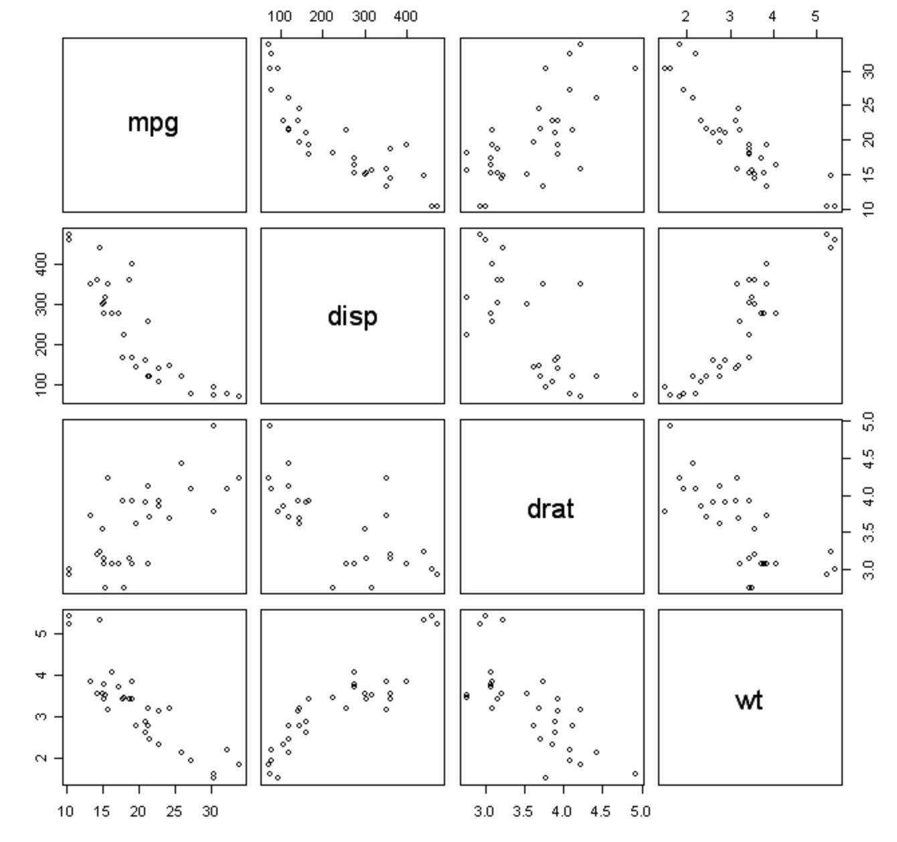
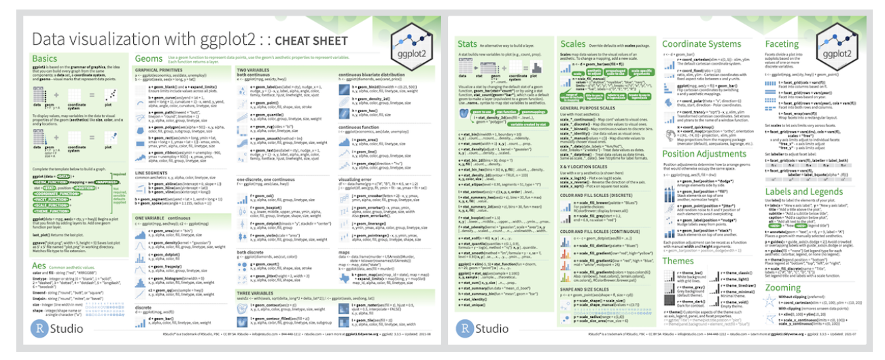

```{r}
#| include: FALSE
library(tidyverse)
knitr::opts_chunk$set(eval = TRUE, echo = TRUE)
```

## Plan for Today

-   Continue discussing plots in `ggplot`

::: extrapad
-   Examine Bar graphs
:::

::: extrapad
-   Examine editing labels and themes
:::

::: extrapad
-   In class activity
:::

## Plots in R

<center></center>

## The Anatomy of ggplot

-   Standard:

```{r}
#| eval: FALSE

ggplot(data = <DATA>) + 
        <GEOM_FUNCTION>(mapping = aes(<MAPPINGS>))
```

<br>

-   Recall (again...)

    -   `ggplot()` is the plot function
        -   Creates a coordinate system that you can add layers to
    -   `(Data =)` is where you specify the dataset that you are using
    -   `geom_point()` is an added layer, which specifies how the data will be plotted
    -   `mapping` defines how variables in your dataset are mapped to visual properties
    -   `aes` specify which variables to map to the x and y axes

------------------------------------------------------------------------

-   Using pipes:

```{r}
#| eval: FALSE

<DATA> %>%
        ggplot() + 
        <GEOM_FUNCTION>(mapping = aes(<MAPPINGS>))
```

## Plotting Functions

<center></center>

[ggplot Cheatsheet](https://ggplot2.tidyverse.org/index.html#cheatsheet)

## Aesthetics

-   Color / Fill / Alpha (transparency)

::: extrapad
-   Size
:::

::: extrapad
-   Shape
:::

::: extrapad
-   Points / Lines / Text
:::

## Faceting

-   Faceting creates subplots that each display one subset of the data.
    -   useful for categorical variables
-   For a single variable, use `facet_wrap(~ <VARIABLE NAME>)`

```{r}
#| eval: TRUE
#| echo: TRUE
#| out-width: 100%
#| out-height: 100%

ggplot(data = mpg) + 
  geom_point(mapping = aes(x = displ, y = hwy, color = class)) + 
  facet_wrap(~ class, nrow = 2)
```

-   For a combination of two variables, use \`facet_grid(<VARIABLE NAME> \~ <VARIABLE NAME>)

```{r}
#| eval: TRUE
#| echo: TRUE
#| out-width: 100%
#| out-height: 100%

ggplot(data = mpg) + 
  geom_point(mapping = aes(x = displ, y = hwy, color = class)) + 
  facet_grid(drv ~ cyl)
```

## Geometric Objects

-   Geoms
    -   A geom is the geometrical object that a plot uses to represent data
    -   People often describe plots by the type of geom that the plot uses
    -   Every geom function in `ggplot` takes a mapping argument
        -   Not every aesthetic works with every geom
            -   You could set the shape of a point, but you couldn’t set the “shape” of a line

```{r}
#| eval: TRUE
#| echo: TRUE
#| out-width: 100%
#| out-height: 100%

ggplot(data = mpg) + 
  geom_point(mapping = aes(x = displ, y = hwy))

ggplot(data = mpg) + 
  geom_smooth(mapping = aes(x = displ, y = hwy))
```

## Multiple Geoms

```{r}
#| eval: TRUE
#| echo: TRUE
#| out-width: 100%
#| out-height: 100%

ggplot(data = mpg) + 
  geom_point(mapping = aes(x = displ, y = hwy)) +
  geom_smooth(mapping = aes(x = displ, y = hwy))
```

-   What do you notice about the code above?

------------------------------------------------------------------------

-   How could this code be more efficient?

```{r}
#| eval: TRUE
#| echo: TRUE
#| out-width: 100%
#| out-height: 100%

ggplot(data = mpg, mapping = aes(x = displ, y = hwy)) + 
  geom_point() + 
  geom_smooth()
```

------------------------------------------------------------------------

-   What is the difference between these two code chunks?
    -   Global vs local mapping
    -   By passing a set of mappings to `ggplot()`, this will treat the mapping as global and apply to EACH geom
    -   By passing a set of mappings to `geom`, this will treat the mapping as local and apply to ONLY that geom

```{r}
#| eval: TRUE
#| echo: TRUE
#| out-width: 100%
#| out-height: 100%

ggplot(data = mpg, mapping = aes(x = displ, y = hwy)) + 
  geom_point(mapping = aes(color = class)) + 
  geom_smooth()
```

## Other `ggplot` functions

-   `coord_flip` flips the x and y axis to improve the readability of plots

::: extrapad
-   `scales` change the formatting of x and y axes
:::

::: extrapad
-   `plotly` makes plots interactive; you can hover over points/lines for more information
:::

::: extrapad
-   `labs` allows you to add/edit a title, subtitle, a caption, and change the x and y axis labels
:::

::: extrapad
-   `gganimate` allows you to animate plots into gifs
:::

## Barplot

-   Bar plots show the relationship between a numeric and categorical variable

::: extrapad
-   Bar charts, histograms, and frequency polygons bin your data and then plot bin counts
:::

```{r}
#| eval: TRUE
#| echo: TRUE
#| out-width: 100%
#| out-height: 100%

library(tidyverse)

diamonds

?diamonds
```

------------------------------------------------------------------------

-   Let's build a bar graph that examines the different types of "cut" in the data.

```{r}
#| eval: TRUE
#| echo: TRUE
#| out-width: 100%
#| out-height: 100%

ggplot(data = diamonds) + 
  geom_bar(mapping = aes(x = cut))
```

-   What do we notice about this plot?
    -   Where did "count" come from?

## `stat_count()`

-   Many graphs, like scatterplots, plot the raw values of your dataset. Other graphs, like bar charts, calculate new values to plot. How does `ggplot()` compute this?

::: extrapad
-   `geom_bar()` utilizes `stat_count()` as the default way to make statistical transformations for bar graphs
:::

```{r}
#| eval: FALSE
#| echo: TRUE
#| out-width: 100%
#| out-height: 100%

?geom_bar
```

<center></center>

------------------------------------------------------------------------

-   You can generally use `geoms` and `stats` interchangeably.

::: extrapad
-   Every geom has a default stat
:::

::: extrapad
-   Every stat has a default geom
:::

::: extrapad
-   This means that you can typically use geoms without worrying about the underlying statistical transformation
:::

```{r}
#| eval: TRUE
#| echo: TRUE
#| out-width: 100%
#| out-height: 100%

ggplot(data = diamonds) + 
  stat_count(mapping = aes(x = cut))
```

------------------------------------------------------------------------

-   Most of the time, we are not going to be concerned with changing `stat`

-   `stat = "identity"`

```{r}
#| eval: TRUE
#| echo: TRUE
#| out-width: 100%
#| out-height: 100%

demo <- tribble(
  ~cut,         ~freq,
  "Fair",       1610,
  "Good",       4906,
  "Very Good",  12082,
  "Premium",    13791,
  "Ideal",      21551
)

ggplot(data = demo) +
  geom_bar(mapping = aes(x = cut, y = freq), stat = "identity")
```

-   `y = stat(prop), group = 1`

```{r}
#| eval: TRUE
#| echo: TRUE
#| out-width: 100%
#| out-height: 100%

ggplot(data = diamonds) + 
  geom_bar(mapping = aes(x = cut, y = stat(prop), group = 1))
```

## Color and Position Adjustments

-   **Color**
    -   You can use `color =`
    -   You can use `fill =`
-   Which one is more useful?

```{r}
#| eval: TRUE
#| echo: TRUE
#| out-width: 100%
#| out-height: 100%

ggplot(data = diamonds) + 
  geom_bar(mapping = aes(x = cut, color = cut))

ggplot(data = diamonds) + 
  geom_bar(mapping = aes(x = cut, fill = cut))
```

------------------------------------------------------------------------

-   How does the color aesthetic change if we use the variable "clarity"

```{r}
#| eval: TRUE
#| echo: TRUE
#| out-width: 100%
#| out-height: 100%

ggplot(data = diamonds) + 
  geom_bar(mapping = aes(x = cut, fill = clarity))
```

------------------------------------------------------------------------

-   **Position**
    -   The stacking from the plot above is performed automatically when `position =` is left unchanged
    -   If you don’t want a stacked bar chart, you can use one of three other options
        -   "identity"
        -   "dodge"
        -   "fill"

------------------------------------------------------------------------

-   **Identity**
    -   Place each object exactly where it falls in the context of the graph
    -   Overlaps the bars
    -   Not useful for bar graphs

```{r}
#| eval: TRUE
#| echo: TRUE
#| out-width: 100%
#| out-height: 100%

ggplot(data = diamonds, mapping = aes(x = cut, fill = clarity)) + 
  geom_bar(position = "identity")

ggplot(data = diamonds, mapping = aes(x = cut, fill = clarity)) + 
  geom_bar(alpha = 1/5, position = "identity")
```

------------------------------------------------------------------------

-   **Fill**
    -   Like stacking, but makes each set of stacked bars the same height
    -   Easier to compare proportions across groups

```{r}
#| eval: TRUE
#| echo: TRUE
#| out-width: 100%
#| out-height: 100%

ggplot(data = diamonds) + 
  geom_bar(mapping = aes(x = cut, fill = clarity), position = "fill")
```

------------------------------------------------------------------------

-   **Dodge**
    -   Places overlapping objects directly beside one another
    -   Easier to compare individual values

```{r}
#| eval: TRUE
#| echo: TRUE
#| out-width: 100%
#| out-height: 100%

ggplot(data = diamonds) + 
  geom_bar(mapping = aes(x = cut, fill = clarity), position = "dodge")
```

## Graphics for Communication

-   When exploring data, yourself, you are aware of the data/graph that you have created

::: extrapad
-   When creating graphs for explanation, you need to ensure that your audience understands the graph
:::

## Labels

-   Title
-   x - axis
-   y - axis

```{r}
#| eval: TRUE
#| echo: TRUE
#| out-width: 100%
#| out-height: 100%

#adding a title
ggplot(data = diamonds) + 
  geom_bar(mapping = aes(x = cut, fill = clarity), position = "dodge") + 
  labs(title = "Cut of Diamond by Clarity")

#adding a x-axis
ggplot(data = diamonds) + 
  geom_bar(mapping = aes(x = cut, fill = clarity), position = "dodge") + 
  labs(title = "Cut of Diamond by Clarity",
       x = "Diamond Cut")

#adding a y-axis
ggplot(data = diamonds) + 
  geom_bar(mapping = aes(x = cut, fill = clarity), position = "dodge") + 
  labs(title = "Cut of Diamond by Clarity",
       x = "Diamond Cut",
       y = "Number of Diamonds")
```

## Scales

-   Adjusting the scales allows you to control the range of the x and y-axis
-   \``ggplot()` automatically adds default scales behind the scenes

```{r}
#| eval: TRUE
#| echo: TRUE
#| out-width: 100%
#| out-height: 100%

#change y-axis scale
ggplot(data = diamonds) + 
  geom_bar(mapping = aes(x = cut, fill = clarity), position = "dodge") + 
  labs(title = "Cut of Diamond by Clarity",
       x = "Diamond Cut",
       y = "Number of Diamonds") +
  scale_y_continuous(breaks = seq(0, 6000, by = 500), limits = c(0, 6000)) 

#change x-axis scale (labels)
ggplot(data = diamonds) + 
  geom_bar(mapping = aes(x = cut, fill = clarity), position = "dodge") + 
  labs(title = "Cut of Diamond by Clarity",
       x = "Diamond Cut",
       y = "Number of Diamonds") +
  scale_y_continuous(breaks = seq(0, 6000, by = 500), limits = c(0, 6000)) +
  scale_x_discrete(labels = c("eh", "ok", "better", "wow", "hey now"))
```

## Themes

-   Default theme has a grey background
-   Not the most visually pleasing

```{r}
#| eval: TRUE
#| echo: TRUE
#| out-width: 100%
#| out-height: 100%

#default theme
ggplot(data = diamonds) + 
  geom_bar(mapping = aes(x = cut, fill = clarity), position = "dodge")

#theme_bw()
ggplot(data = diamonds) + 
  geom_bar(mapping = aes(x = cut, fill = clarity), position = "dodge") +
  theme_bw()

#theme_bw() with grid removed
ggplot(data = diamonds) + 
  geom_bar(mapping = aes(x = cut, fill = clarity), position = "dodge") +
  scale_y_continuous(breaks = seq(0, 6000, by = 500), limits = c(0, 6000)) +
  theme_bw() +
  theme(axis.line = element_line(color='black'),
    plot.background = element_blank(),
    panel.grid.minor = element_blank(),
    panel.grid.major = element_blank())

#theme_bw() with origin at 0,0
ggplot(data = diamonds) + 
  geom_bar(mapping = aes(x = cut, fill = clarity), position = "dodge") +
  scale_y_continuous(breaks = seq(0, 6000, by = 500), limits = c(0, 6000), expand = c(0,0)) +
  theme_bw() +
  theme(axis.line = element_line(color='black'),
    plot.background = element_blank(),
    panel.grid.minor = element_blank(),
    panel.grid.major = element_blank())
```

## In-Class Activity

-   We are going to practice producing and altering `ggplot()`

-   Get with a partner and work through [Week 3 \| Class Activity]{style="color:#000E2F"}

## For Next Class

-   Review what you learned today

-   Do new set of readings:

    -   We are going to discuss how we transform data in R with Tidyverse
    -   [R4DS Chapter 3]{style="color:#000E2F"}
        -   Follow along the exercises with your own computer

-   Bring your laptops to class
