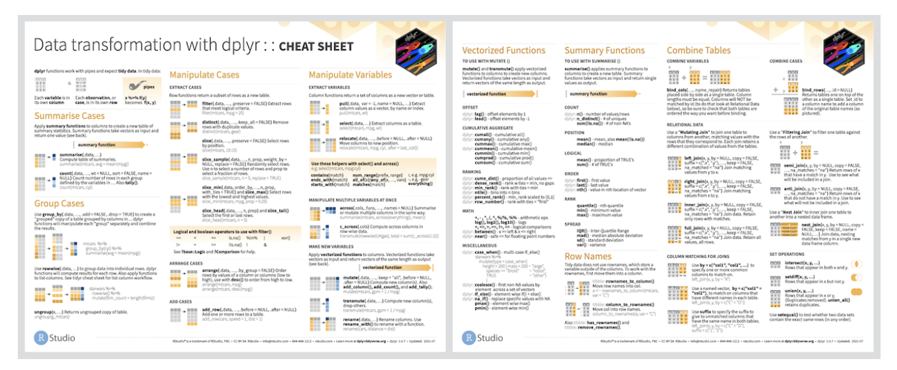
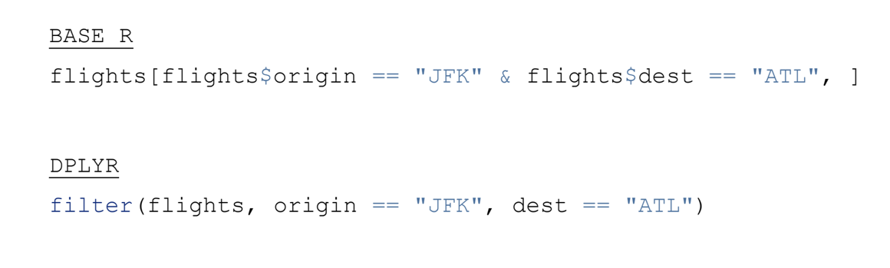
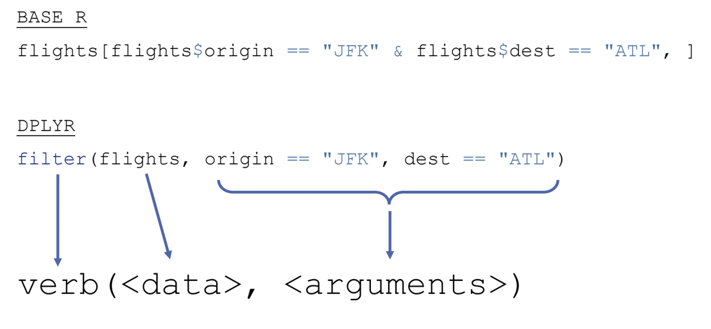
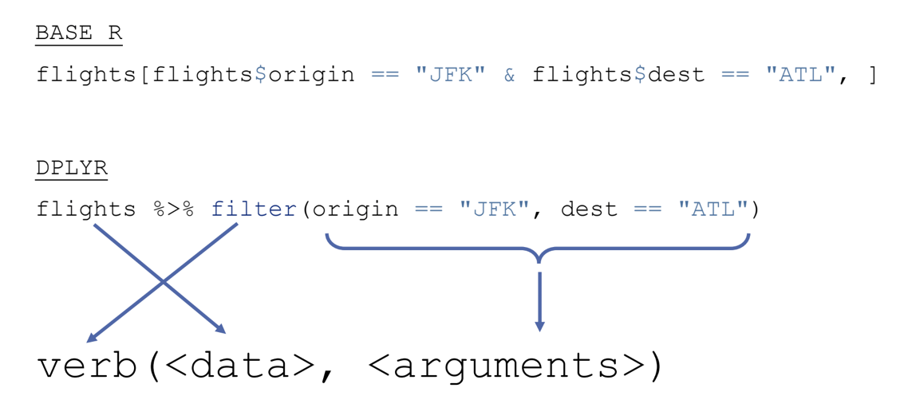
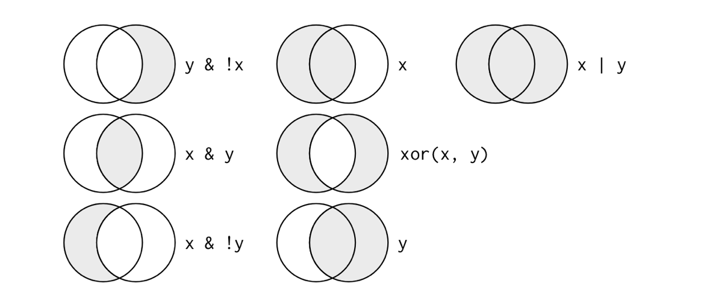

```{r}
#| include: FALSE
library(tidyverse)
knitr::opts_chunk$set(eval = TRUE, echo = TRUE)
```

## Plan for Today

-   Explore data transformation in R

::: extrapad
-   Explore the `dplyr` package/functions within `tidyverse`
:::

::: extrapad
-   In class activity
:::

## `dplyr`

<center></center>

[dplyr cheatsheet](https://github.com/rstudio/cheatsheets/blob/master/data-transformation.pdf)

## `dplyr` Verbs

-   Pick observations by their value `filter()`

::: extrapad
-   Reorder the rows `arrange()`
:::

::: extrapad
-   Pick variables by their names `select()`
:::

::: extrapad
-   All verbs work similarly:
    -   The first argument is a data frame.
    -   The subsequent arguments describe what to do with the data frame, using the variable names (without quotes)
    -   The result is a new data frame
:::

------------------------------------------------------------------------

<center></center>

------------------------------------------------------------------------

<center></center>

------------------------------------------------------------------------

<center></center>

## `filter()`

-   Allows you to subset observations based on their values

::: extrapad
-   Let us examine this with the `flights` dataset.
:::

```{r}
#| eval: TRUE
#| echo: TRUE

#install.packages("nycflights13")

library(nycflights13)

nycflights13::flights

flights <- nycflights13::flights

?flights
```

```{r}
#| eval: TRUE
#| echo: TRUE

flights |>
  filter(month == 1 & day == 1)
```

<br>

-   Notice that we have created a new data frame
    -   The new data frame contains on flights from January 1st

```{r}
#| eval: TRUE
#| echo: TRUE

#if we wanted to keep the data frame
jan1 <- flights |>
  filter(month == 1 & day == 1)
```

## Comparisons and Logical Operators

-   You will need to make use of comparisons and logical operators when utilizing the `filter()` function

::: extrapad
-   **Comparisons**
    -   `>` (greater than)
    -   `>=` (greater than or equal)
    -   `<` (less than)
    -   `<=` (less than or equal)
    -   `!=` (not equal)
    -   `==` (equal)
:::

------------------------------------------------------------------------

-   **Logical Operators**
    -   `&` (and)
    -   `|` (or)
    -   `!` (not)

<center></center>

## Missing Values

-   One important feature of R that can make comparison tricky are missing values

```{r}
#| eval: TRUE
#| echo: TRUE

stocks <- data.frame(
  year   = c(2015, 2015, 2015, 2015, 2016, 2016, 2016),
  name   = c("AAPL", "AAPL", "AAPL", "AAPL", "AAPL", "AAPL", "AAPL"),
  qtr    = c(   1,    2,    3,    4,    2,    NA,    4),
  return = c(1.88, 0.59, 0.35,   NA, 0.92, 0.17, 2.66)
)
```

<br>

-   Recall how we deal with "NA" in data

```{r}
#| eval: FALSE

is.na()
```

```{r}
#| eval: TRUE
#| echo: TRUE

stocks %>%
  filter(qtr == 2)

stocks %>%
  filter(is.na(qtr) | is.na(return))

stocks %>%
  filter(!is.na(qtr) & !is.na(return))

```

## `arrange()`

-   works similarly to `filter()` except that instead of selecting rows, it changes their order

::: extrapad
-   Missing values are always sorted at the end
:::

```{r}
#| eval: TRUE
#| echo: TRUE

flights %>%
  arrange(month)
```

<br>

-   If you provide more than one column name, each additional column will be used to break ties in the values of preceding columns

```{r}
#| eval: TRUE
#| echo: TRUE

flights %>%
  arrange(year, month, day)
```

<br>

-   Use `desc()` to re-order by a column in descending order

```{r}
#| eval: TRUE
#| echo: TRUE

flights %>%
  arrange(desc(dep_delay))
```

## `select()`

-   Allows you to rapidly zoom in on a useful subset using operations based on the names of the variables

```{r}
#| eval: TRUE
#| echo: TRUE

#selects just the columns named in the function
flights %>%
  select(year, month, day)

#selects the columns including and between year and day with :
flights %>%
  select(year:day)

#selection all columns except year through day
flights %>%
  select(-(year:day))
```

------------------------------------------------------------------------

-   Helpful functions that can be used with `select()`
    -   `starts_with("abc")` matches names that being with "abc"
    -   `ends_with("xyz")` matches names that end with "xyz"
    -   `contains("ijk")` matches names that contain "ijk"
    -   `matches("(.)\\1")` selects variables that match a regular expression. This one matches any variables that contain repeated characters. You’ll learn more about regular expressions in strings
    -   `num_range("x", 1:3)` matches x1, x2, and x3

## `rename()`

-   A function that allows you to rename variables

```{r}
#| eval: TRUE
#| echo: TRUE

flights %>%
  rename(tail_num = tailnum)
```

## Break
