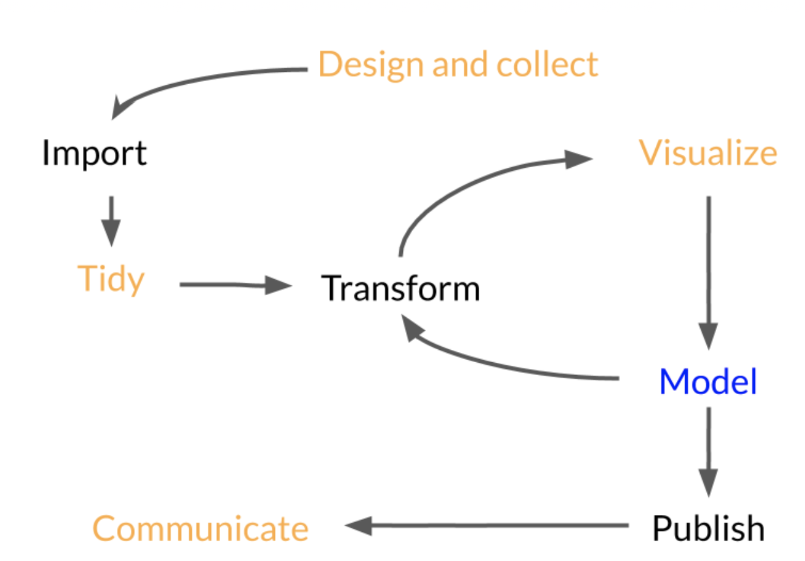

```{r}
#| include: FALSE
library(tidyverse)
knitr::opts_chunk$set(eval = TRUE, echo = TRUE)
```

## Plan for Today

- Examining how to explore data in R


## Exploratory Data Analysis

<center></center>


## Exploratory Data Analysis

::: extrapad
- Data exploration is a process:
:::

::: extrapad
- Design and collect
  + What are you interested in? 
  + Data collection process
:::

::: extrapad
- Import the data 
:::

::: extrapad
- Tidy the data (more to come later)
:::

::: extrapad
- Transform the data
:::

::: extrapad
- Visualize the data
:::

- Model the data


## Questions to Consider

::: extrapad
- What type of variation occurs within my variables?
  
  - the tendency of the values of a variable to change from measurement to measurement
:::

::: extrapad
- What type of covariation occurs between my variables?

  -  the tendency for the values of two or more variables to vary together in a related way
:::

## Useful Terms

::: extrapad
- **Variable**
  + quantity, quality, or property that you can measure
:::

::: extrapad
- **Value**
  + The state of a variable when you measure it
  + The value of a variable may change from measurement to measurement 
:::

::: extrapad
- **Observation**
  + A set of measurements made under similar conditions (you usually make all of the measurements in an observation at the same time and on the same object)
  + Will contain several values, each associated with a different variable
  + Sometimes refer to an observation as a data point
:::


- **Tabular Data**
  + Is a set of values, each associated with a variable and an observation
  + Tabular data is `tidy` if each value is placed in its own “cell”, each variable in its own column, and each observation in its own row


## Variation

::: extrapad
- Variation
  
  - the tendency of the values of a variable to change from measurement to measurement
    
    + Think about eye color
:::

::: extrapad
- Every variable has its own pattern of variation, which can reveal interesting information
:::

- The best way to understand that pattern is to visualize the distribution of the variable’s values


## Visualizing Distributions

::: extrapad
- How you visualize the distribution of a variable will depend on whether the variable is categorical or continuous
:::

::: extrapad
- Categorical Variables
  + only take one of a small set of values
  + R will usually save these as factor or character vectors
:::

```{r}
#| eval: TRUE
#| echo: TRUE
#| out-width: 100%
#| out-height: 100%

ggplot(data = diamonds) +
  geom_bar(mapping = aes(x = cut))
```

## Visualizing Distributions

- Continuous
  + can take any of an infinite set of ordered values
  
```{r}
#| eval: TRUE
#| echo: TRUE
#| out-width: 100%
#| out-height: 100%

ggplot(data = diamonds) +
  geom_histogram(mapping = aes(x = carat), binwidth = 0.5)
```

## Visualizing Distributions

::: extrapad
- Histogram
  - Divides the x-axis into equally spaced bins
  - Uses the height of a bar to display the number of observations that fall in each bin
:::

::: extrapad
- You can set the width of the intervals in a histogram with the `binwidth` argument
  + Measured in the units of the x variable
:::

```{r}
#| eval: TRUE
#| echo: TRUE
#| out-width: 100%
#| out-height: 100%

smaller <- diamonds %>% 
  filter(carat < 3)
  
ggplot(data = smaller, mapping = aes(x = carat)) +
  geom_histogram(binwidth = 0.1)
```


## Visualizing Distributions

- Multiple Histograms

- `geom_freqpoly()`performs the same calculation as `geom_histogram()`, but instead of displaying the counts with bars, uses lines instead

```{r}
#| eval: TRUE
#| echo: TRUE
#| out-width: 100%
#| out-height: 100%

ggplot(data = smaller, mapping = aes(x = carat, colour = cut)) +
  geom_freqpoly(binwidth = 0.1)
```


## Outliers

::: extrapad
- Outliers are observations that are unusual; data points that don’t seem to fit the pattern
:::

::: extrapad
- Sometimes outliers are data entry errors; other times outliers suggest important new science
:::

::: extrapad
- When you have a lot of data, outliers are sometimes difficult to see
:::


## Outliers

```{r}
#| eval: TRUE
#| echo: TRUE
#| out-width: 100%
#| out-height: 100%

ggplot(diamonds) + 
  geom_histogram(mapping = aes(x = y), binwidth = 0.5)
```

- There are so many observations in the common bins that the rare bins are so short that you can’t see them

```{r}
#| eval: TRUE
#| echo: TRUE
#| out-width: 100%
#| out-height: 100%

ggplot(diamonds) + 
  geom_histogram(mapping = aes(x = y), binwidth = 0.5) +
  coord_cartesian(ylim = c(0, 50))
```


## Outliers

```{r}
unusual <- diamonds %>% 
  filter(y < 3 | y > 20) %>% 
  select(price, x, y, z) %>%
  arrange(y)

unusual
```

::: extrapad
- The y variable measures one of the three dimensions of these diamonds in mm
  + Diamonds can’t have a width of 0mm
:::

::: extrapad
- Measurements of 32mm and 59mm are implausible
  + Those diamonds are over an inch long, but don’t cost hundreds of thousands of dollars
:::  


## Missing Values

::: extrapad
- If you have missing values, you have two options:
:::

::: extrapad
- Listwise delete
  + Drop the entire row with the strange values
:::

```{r}  
diamonds2 <- diamonds %>% 
  filter(between(y, 3, 20))

diamonds2
```

## Missing Values

- Replace the unusual values with `NA`

- Utilize the `ifelse()` command

```{r}
diamonds2 <- diamonds %>% 
  mutate(y = ifelse(y < 3 | y > 20, NA, y))

diamonds2
```


## Conditional Statements
- Additionally, when you want to create a new variable that relies on a complex combination of existing variables
  + Utilize the `ifelse()` or `case_when()` command
  
```{r}
diamonds %>%
  mutate(size_category = case_when(
    carat < 0.25 ~ "tiny",
    carat < 0.5  ~ "small",
    carat < 1    ~ "medium",
    carat < 1.5  ~ "large",
    TRUE         ~ "huge"
  )) %>%
  select(size_category, everything())
```


## Break
