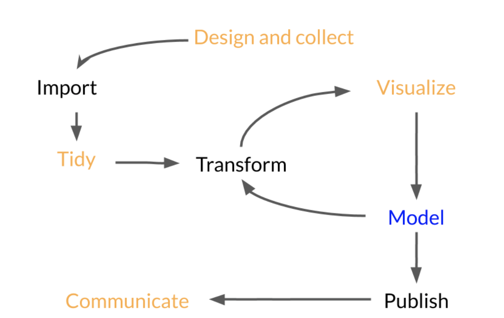
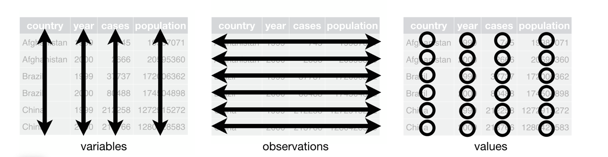
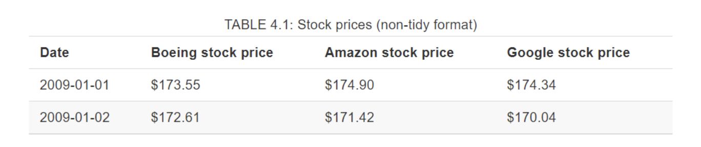
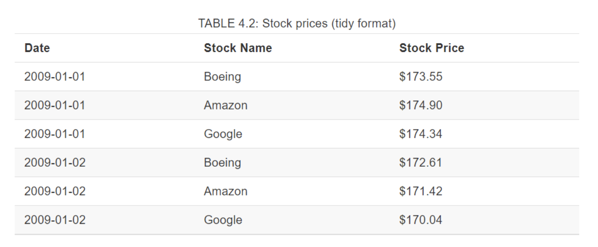
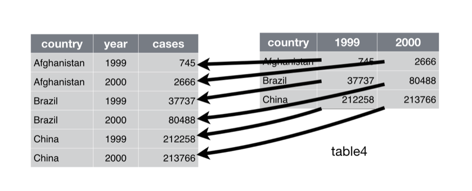
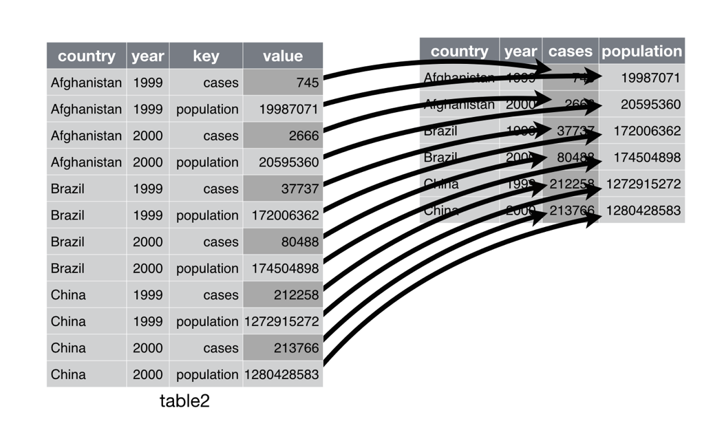

```{r}
#| include: FALSE
library(tidyverse)
knitr::opts_chunk$set(eval = TRUE, echo = TRUE)
```

## Plan for Today

- Explore data R with `Tidyverse`
- Discuss `tibbles`
- Discuss `Tidy` data


## Tibbles

- What is a tibble?
  
  + Tibbles are data frames
    
    + But they try and enhance the regular "old" data frame from base R
    
- To learn more

  + vignette("tibble")
  

## Creating Tibbles

- Tibbles are one of the unifying features of `tidyverse`

- Most other R packages use regular data frames, so you might want to coerce a data frame to a tibble

  + To do this, use `as_tibble()`
  
```{r}
as_tibble(iris)
```
  
- You can create a new tibble from individual vectors with `tibble()`

  + `tibble()` automatically recycles inputs of length 1 and allows you to refer to variables that you just created
 
## Tibbles

- Let's create a tibble

```{r}
tibble(
  x = 1:5, 
  y = 1,
  z = x ^ 2 + y
)
```

- Tibbles do much less than data frames

  + It never changes the type of the inputs (never converts strings to factors)
  
  + Never changes the name of variables
  
  + Never creates row names
  
- For example:

```{r}
tb <- tibble(
  `:)` = "smile", 
  ` ` = "space",
  `2000` = "number"
)
```

- What do we notice? 

  + Are these column names valid in base R? 
  

## Tribbles

- Transposed Tibble (tribble)

  + Customized for data entry in code:column headings are defined by formulas 
  
  + They start with `~`

```{r}
tribble(
  ~x, ~y, ~z,
  #--|--|----
  "a", 2, 3.6,
  "b", 1, 8.5
)
```


## Tibbles vs. data.frame

- There are two main differences between tibbles and data.frame

  + Printing
  
  + Subsetting
  
## Printing

- Tibbles have a refined print method that shows only the first 10 rows

```{r}
tibble(
  a = lubridate::now() + runif(1e3) * 86400,
  b = lubridate::today() + runif(1e3) * 30,
  c = 1:1e3,
  d = runif(1e3),
  e = sample(letters, 1e3, replace = TRUE)
)
```

- Tibbles are designed so that you don’t accidentally overwhelm your console when you print large data frames

## Printing

- If you need more output than the default displays, then you can use the following options

  + `print()`
  
    + `n` controls the number of rows
    
    + `width` determines how many columns to display
  
- You can also control default print behavior by settings options

  + `options(tibble.print_max = n, tibble.print_min = m)`
  
    + if more than `n` rows, print only `m` rows
    
  + `options(tibble.print_min = Inf)`
  
    + To always show all rows
    
  + `options(tibble.width = Inf)`
  
    + To always print all columns, regardless of the width of the screen
    
## Subsetting

- Most of the subsetting tools that we have used this far generally subset the entire data frame

- How do we pull out just a single variable/value?

  + We can us `$` and `[[`
  
    + `[[` extracts by name or position
    
    + `$` extracts by name but is less typing
    
```{r}
df <- tibble(
  x = runif(5),
  y = rnorm(5)
)

# Extract by name
df$x

df[["x"]]


# Extract by position
df[[1]]

df[[1,1]]

```

## Tidy Data

<center></center>

- What does it mean to tidy up data?

  + Structuring datasets to facilitate analysis (- Hadley Wickham)

- Tidy Rules

  + Each variable forms a column
  
  + Each observation forms a row
  
  + Each type of observational unit forms a table
  
## Tidy Data
  
- Visualizing the tidy rules

<center></center>

## Tidy Data

- How to tell if your data or untidy

  + Column headers are values instead of variable names
  
  + Multiple variables are stored in one column (e.g., City_State)
  
  + Variables are stored in both rows and columns
  
  + Multiple types of observational units are stored in the same table
  
  + A single observational unit is stored in multiple tables
  
  + Dataset is either too long or too wide

## Untidy Data  
- Untidy data example

<center></center>

<br>

- Let's clean it up!

<center></center>


## Pivoting

- Most data that you encounter will be untidy

  + Most people aren’t familiar with the principles of tidy data, and it’s hard to derive them yourself unless you spend a lot of time working with data
  
  + Data is often organised to facilitate some use other than analysis. For example, data is often organised to make entry as easy as possible
  
- Things to look out for

  + One variable might be spread across multiple columns
  
  + One observation might be scattered across multiple rows
  
    + Usually, a dataset will only suffer from one of these problems
    
- Two functions that we will use

  + `pivot_longer()`
  
  + `pivot_wider()`
  

## Pivot Longer

- A common problem is a dataset where some of the column names are not names of variables, but values of a variable

```{r}
table4a
```

- To tidy a dataset like this, we need to pivot the offending columns into a new pair of variables

## Pivot Longer

- How do we utilize this function?

  + The set of columns whose names are values, not variables. In this example, those are the columns 1999 and 2000
  
  + The name of the variable to move the column names to. Here it is year
  
  + The name of the variable to move the column values to. Here it’s cases
  
```{r}
table4a |> 
  pivot_longer(c(`1999`, `2000`), names_to = "year", values_to = "cases")
```

- In the final result, the pivoted columns are dropped, and we get new year and cases columns

- Otherwise, the relationships between the original variables are preserved

## Pivot Longer

<center></center>

- pivot_longer() makes datasets longer by increasing the number of rows and decreasing the number of columns


## Pivot Wider

- pivot_wider() is the opposite of pivot_longer()

- You use it when an observation is scattered across multiple rows

```{r}
table2
```

- To tidy this up, we first analyse the representation in similar way to `pivot_longer()`

  + The column to take variable names from. Here, it’s type
  
  + The column to take values from. Here it’s count
  
```{r}
table2 |>
    pivot_wider(names_from = type, values_from = count)
```

<center></center>

## Break


