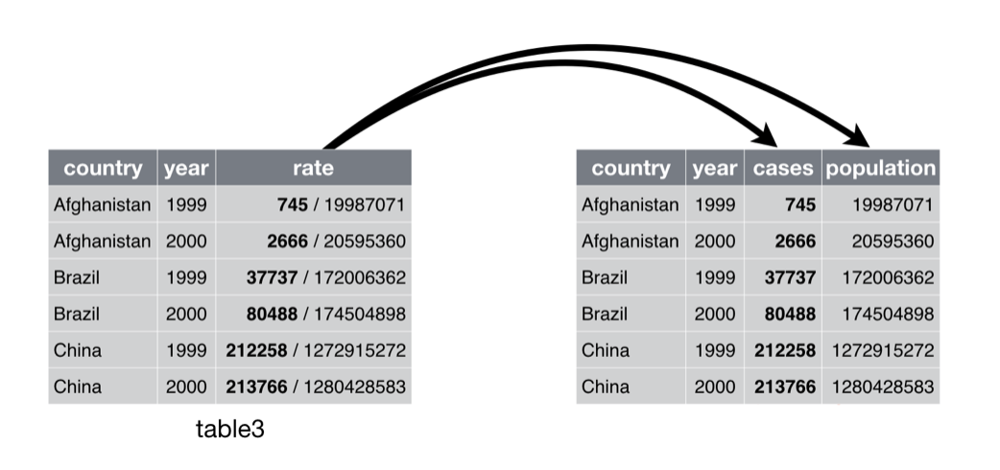
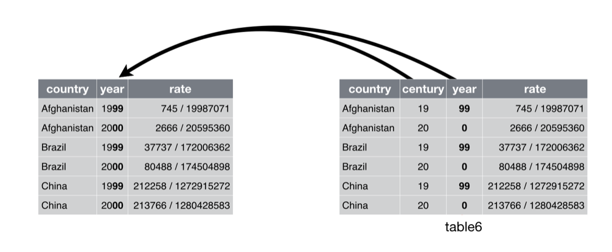
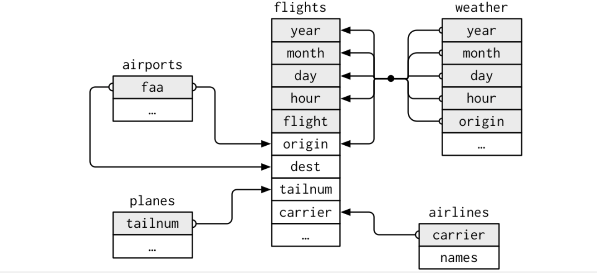
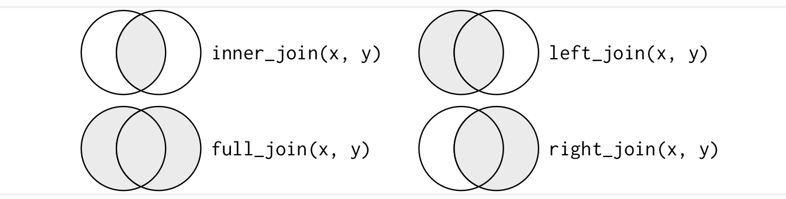

```{r}
#| include: FALSE
library(tidyverse)
knitr::opts_chunk$set(eval = TRUE, echo = TRUE)
```

## Plan for Today

- Explore data R with `Tidyverse`
- Continue our discussion of `tidy` data
- Discuss `Relational` data
- In class activity

---

## Separating

- `separate()` pulls apart one column into multiple columns, by splitting wherever a separator character appears

```{r}
table3
```

- Notice the `rate` column

  + It contains both cases and population variables, and we need to split it into two variables

## Separate

- `separate()` takes the name of the column to separate, and the names of the columns to separate into 

```{r}
table3 %>% 
  separate(rate, into = c("cases", "population"))
```

<center></center>
  
## Separate
  
- By default, `separate()` will split values wherever it sees a non-alphanumeric character (i.e. a character that isn’t a number or letter)

  + For example, in the code above, `separate()` split the values of rate at the forward slash characters
  
- If you wish to use a specific character to separate a column, you can pass the character to the `sep` argument of `separate()`

```{r}
table3 %>% 
  separate(rate, into = c("cases", "population"), sep = "/")
```

## Unite

- `unite()` is the inverse of `separate()`: it combines multiple columns into a single column

<center></center>

## Unite

- We can use `unite()` to rejoin the century and year columns

```{r}
table5

table5 %>% 
  unite(new, century, year)
```
  

- In this case we also need to use the `sep` argument  
  
- The default will place an underscore (_) between the values from different columns

```{r}
table5 %>% 
  unite(new, century, year, sep = "")
```


## Relational Data

- In many data science jobs, you will have access to multiple tables of data

- Your job will be to combine these tables to answer questions of interest

- Collectively, multiple tables are called relational data

- Individually, the datasets are meaningful; but the relationship between the datasets is more meaningful

- Relational data often maintained in a database


## Relational Data

- We will use the `nycflights13` package to learn about relational data

- `nycflights13` contains four tibbles that are related to the flights table that you used in data transformation

```{r}
library(nycflights13)
```

<br>

- `airlines` lets you look up the full carrier name from its abbreviated code

```{r}
airlines
```

<br>

- `airports` gives information about each airpot, identified by the `faa` airport code

```{r}
airports
```

<br>

- `planes` gives information about each plane, identified by its `tailnum`

```{r}
planes
```

<br>

- `weather` gives the weather at each NYC airport for each hour

```{r}
weather
```


## Relational Data

- The relationship between these tables

<center></center>

<br>

- How do these four datasets connect to `ncyflights13`

  + flights connects to planes via a single variable, tailnum
  
  + flights connects to airlines through the carrier variable
  
  + flights connects to airports in two ways: via the origin and dest variables
  
  + flights connects to weather via origin (the location), and year, month, day and hour (the time)
  

## Keys

- The variables used to connect each pair of tables are called keys

  + A key is a variable (or set of variables) that uniquely identifies an observation
  
- Primary Key

  + uniquely identifies an observation in its own table. For example, planes$tailnum is a primary key because it uniquely identifies each plane in the planes table
  
- Foreign Key

  + uniquely identifies an observation in another table. For example, flights$tailnum is a foreign key because it appears in the flights table where it matches each flight to a unique plane
  
- A variable can be both a primary and a foreign key

- Once you’ve identified the primary keys in your tables, it’s good practice to verify that they do indeed uniquely identify each observation

## Keys
  
- Use `count()`
  
```{r}
planes %>% 
  count(tailnum) %>% 
  filter(n > 1)
```

```{r}
weather %>% 
  count(year, month, day, hour, origin) %>% 
  filter(n > 1)
```


## Mutating Joins

- Allows us to combine a pair a tables

- It first matches observations by their keys, then copies across variables from one table to the other

- Like `mutate()`, the join functions add variables to the right

```{r}
flights2 <- flights %>% 
  select(year:day, hour, origin, dest, tailnum, carrier)

flights2
```

## Mutating Joins

- What if we wanted to add the full airline name to the `flights2()` data?

  + We can combine the `airlines` and `flights2()` data with `left_join()`
  
```{r}
flights2 %>%
  select(-origin, -dest) %>% 
  left_join(airlines, by = "carrier")
```


## Understanding Joins

**Inner Join**

- An inner join matches pairs of observations whenever their keys are equal

**Outer Join**

- An outer join keeps observations that appear in at least one of the tables

  + There are three types of outer joins
    
    + Left join: keeps all observations in x
    
    + Right join: keeps all observations in y
    
    + full join: keeps all observations in x and y
    
<center></center>


## For Next Class

-   Review what you learned today

-   Do new set of readings:

    -   We are going to continue or discuss of relational data
    -   [R4DS Chapter 14]{style="color:#000E2F"}
    -   [R4DS Chapter 16]{style="color:#000E2F"}
    -   [R4DS Chapter 17]{style="color:#000E2F"}
    -   [R4DS Chapter 19.3 - 19.6]{style="color:#000E2F"}
        -   Follow along the exercises with your own computer

-   Bring your laptops to class
