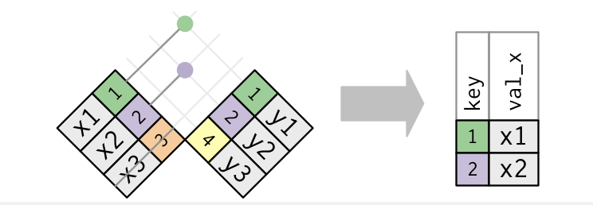
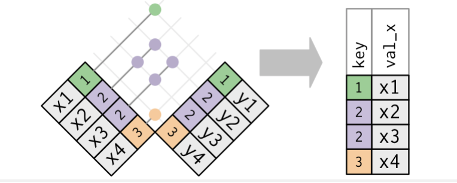
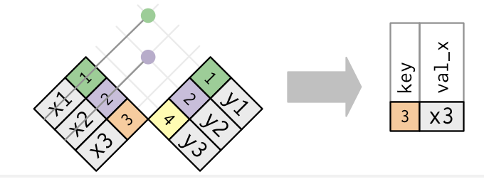

```{r}
#| include: FALSE
library(tidyverse)
knitr::opts_chunk$set(eval = TRUE, echo = TRUE)
```

## Plan for Today

- Continue our discussion of `relational` data
- Discuss `strings`, `factors`, and `dates and times`
- Discuss Group Project

---

## Filtering Joins

- **semi_join**

  - Filtering joins match observations in the same way as mutating joins, but affect the observations, not the variables

    + `semi_join(x, y)`
  
      + keeps all observations in x that have a match in y
    
    <br>
    
  + `anti_join(x, y)`
  
    + drops all observations in x that have a match in y
    
## Filtering Joins
    
- Semi-joins are useful for matching filtered summary tables back to the original rows

For example, imagine you’ve found the top ten most popular destinations:

```{r}
flights <- nycflights13::flights

top_dest <- flights |>
  count(dest, sort = TRUE) |>
  head(10)

top_dest
```

## Filtering Joins

- Now you want to find each flight that went to one of those destinations. You could construct a filter yourself:

```{r}
flights |> 
  filter(dest %in% top_dest$dest)
```

- What is `%in%` doing in the code above?

## Filtering Joins

- How would we extend the code above to multiple variables? 

- We could use `semi_join`

  + which connects the two tables like a mutating join, but instead of adding new columns, only keeps the rows in x that have a match in y
  

```{r}
flights |> 
  semi_join(top_dest)
```

<center></center>

## Filtering Joins

- Only the existence of a match is important; it doesn’t matter which observation is matched. This means that filtering joins never duplicate rows like mutating joins do

<center></center>

## Filtering Joins

- **anti_join**

- The inverse of a semi-join is an anti-join

  + An anti-join keeps the rows that don’t have a match
  
  + Anti-joins are useful for diagnosing join mismatches
  
- For example, when connecting flights and planes, you might be interested to know that there are many flights that don’t have a match in planes

```{r}
planes <- nycflights13::planes

flights |>
  anti_join(planes, by = "tailnum") |>
  count(tailnum, sort = TRUE)
```

<center></center>
  

## Strings

- What is a string? 

```{r}
string1 <- "This is a string"
string1

string2 <- 'If I want to include a "quote" inside a string, I use single quotes'
string2
```


## String Length

- We will utilize the `stringr` package from `tidyverse`

- Most of all the functions start with `str_`

```{r}
str_length(c("a", "R for data science", NA))
```

- What did this function tell us? 


## Combining Strings

- Use `str_c()` to combine strings

```{r}
str_c("x", "y")

str_c("x", "y", "z")
```

<br>

- Use the `sep` argument to control how they are separated

```{r}
str_c("x", "y", sep = ", ")
```


## Subsetting Strings

- You can extract parts of a string using `str_sub()`

```{r}
x <- c("Apple", "Banana", "Pear")

str_sub(x, start = 1, end = 3)

str_sub(x, start = -3, end = -1)
```


## Factors

- Factors are used to work with categorical variables

- We will use the `forcats` package, which is in the `tidyverse` package


## Creating Factors

- Imagine that you have a variable that records month

```{r}
x1 <- c("Dec", "Apr", "Jan", "Mar")
```

- Using a string to record this variable has two possible problems:

  + There are only twelve possible months, and there's nothing saving you from typos
  
  + It doesn't sort in a useful way
  
```{r}
x2 <- c("Dec", "Apr", "Jam", "Mar")

sort(x1)
```

## Creating Factors

- You can fix both of these issues with a factor

- To create a factor you must start by creating a list of the valid levels

```{r}
month_levels <- c(
  "Jan", "Feb", "Mar", "Apr", "May", "Jun", 
  "Jul", "Aug", "Sep", "Oct", "Nov", "Dec"
)
```

<br>

- Now you can create a factor

```{r}
y1 <- factor(x1, levels = month_levels)

y1

sort(y1)
```


## Dates and Times

- We will use the `lubridate` package, which is in the `tidyverse` package

```{r}
library(lubridate)
```

- There are three types of date/time data that refer to an instant in time

  + A date
  
  + A time within a day
  
  + A date-time is a date plus a time that uniquely identifies an instant in time
  
- To get the current date or date-time you can use the following

## Dates and Times

```{r}
today()

now()
```

- When creating a date/time we usually do so from

  + A string
  
  + Individual date-time components
  
  + Existing date/time objects
  

## From Strings

- Date/time data often comes as strings

- Use functions from `lubridate` to automatically format the date once you specify the order

```{r}
ymd("2017-01-31")

mdy("January 31st, 2017")

dmy("31-Jan-2017")
```


## From Individual Components

- Instead of a single string, sometimes you’ll have the individual components of the date-time spread across multiple columns

```{r}
flights |> 
  select(year, month, day, hour, minute)
```

<br>

- To create a date/time from this sort of input, use `make_date()` for dates, or `make_datetime()` for date-times

```{r}
flights |> 
  select(year, month, day, hour, minute) |> 
  mutate(departure = make_datetime(year, month, day, hour, minute))
```


## For Next Class

-   Review what you learned today

-   Do new set of readings:

    -   We are going to continue or discuss of relational data
    -   [USDR Chapter 1]{style="color:#000E2F"}
    -   [GCR Chapter 1]{style="color:#000E2F"}
    -   [USDR Chapter 3.1-3.4]{style="color:#000E2F"}
    -   [GCR Chapter 8.1 - 8.2]{style="color:#000E2F"}
        -   Follow along the exercises with your own computer

-   Bring your laptops to class
